我国核算年度 GDP 采用的方法为 **支出法**
 #cloze 

## 1 . 经济学原理

1. 经济学研究什么
	经济学是研究个人、企业、政府以及其他组织如何在社会内进行选择，以及这些选择如何决定社会稀缺资源使用的科学。该定义强调**资源的稀缺性**以及**选择的重要性**。
2. 为什么产生经济学
	人类**需求的无限性**与**经济资源的稀缺性**产生了人类社会面临的经济问题。
3. 经济学重要思想（选择、机会成本、稀缺）
	1. 经济资源的稀缺性
		1. 经济资源：**时间**、**信息**、**人力资源**、**自然资源**、**资本资源**。
			记忆方法：中央七套以前有一个“人与自然”栏目，我会花时间和资本去看它，然后得到一些信息。
		2. *生产要素*：**土地**、**资本**、**劳动力**、**企业家才能**。
		3. 马斯洛层次需求理论：**生理需要**、**安全需要**、**情感和归属感需要（社会需要）**、**尊重需要**、**自我实现需要**。
			记忆方法：最基本的当然是生理部分（吃和以及别的），生理需要解决了，就开始考虑自身安全（别被枪崩了）。都说“饱暖思淫欲”，这就是情感和归属感需要。有了情感，就开始考虑人格方面——尊重需要。得到了尊重，想要回报，需要干点什么来实现价值，即为自我实现需要。
		4. 机会成本：**该资源投入某一特定用途以后所放弃的在其他用途中所能获得的最大利益**。
	2. 经济学研究的基本问题
		1. 微观经济学研究的基本问题：**生产什么和生产多少**、**如何生产**、**为谁生产**。**资源配置**
		2. 宏观经济学所考察的基本问题：**一个社会既定的生产资源总量是否得到充分利用**、**如何得以充分利用**。**资源充分利用**
		3. 微观经济学要以**单个经济单位（单个消费者、单个生产者、单个市场经济活动）** 作为研究对象；<u>宏观经济学</u>以**国民经济总过程的活动**为研究对象。
	3. 理性经济人假设：**利己的理性人**，**利己但不损人**
4. 经济学发展历史（微观经济学、宏观经济学基础）
	1. <u>现代经济学说的发展</u>：**启蒙阶段**、**古典学派**、**新古典主义**、**马克思主义和社会主义**、**凯恩斯主义**、**后凯恩斯时代**。
	2. 古典经济学
		1. **亚当·斯密**：《**国富论**》标志着**古典经济学**的诞生，**自由竞争**是古典经济学派的不二信条。奠定**微观经济学**基础
			学说内容：劳动和分工（流水线）、价值价格、经济人和看不见的手
		2. 大卫李嘉图：劳动价值学说
	3. <u>新古典主义</u>
		1. **马歇尔**：新古典经济学的奠基者。
	4. 凯恩斯主义
		1. **凯恩斯**：奠定**宏观经济学**基础。国家干预

## 2 . 微观市场机制分析

### 0 消费者、生产者与市场（没强调这部分）

#### 1.1 消费者

1. 消费者：**具有消费预算**、**能够作出统一消费决策**的**单个经济单位**。

#### 1.2 生产者

1. 生产者：也称企业或厂商，是指**能够作出统一生产和销售决策**的**单个经济单位**。
2. 生产者的演进：**工场手工业**、**工厂制**、**现代企业**
	记忆方法：和企业的发展很像。
3. 生产目标
	1. 短期：**至少有一种生产要素不变**
	2. 长期：**可以调整全部生产要素**。

#### 1.3 市场

1. 市场的类型
	1. 按竞争或垄断程度来分：**完全竞争**、**垄断竞争**、**寡头垄断**、**完全垄断**

### 1 . 需求

1. <u>需求</u>：**消费者**在**某一特定的时期**内和**一定的市场**上在**各种可能的价格水平**下**愿意而且能够购买**的某种商品或服务的数量。在经济学领域，需求是指消费者**有支付能力**的需求，有别于人类无限多样化的需要(Needs)。
2. 需求定律：**商品需求量与价格呈反方向变化**。
	1. 替代效应：**商品价格上升，消费者都会更多购买该商品的替代品，而更少购买价格上升的商品**。
	2. 收入效应：**对于正常品，价格上升，相对收入下降，消费量下降**
	3. <u>低档品</u>：对于低档品，价格上升的替代效应引起的消费量下降大于收入效应引起的消费量上升，**所以消费量依旧会下降**。泡面
	4. <u>吉芬品</u>：特殊低档品，**该低档品需求随价格上升而上升**，价格上升的替代效应引起的消费量下降小于收入效应引起的消费量上升。饥荒时期的土豆
3. <u>需求的影响因素</u>：**该商品的价格（P）**、**相关商品的价格（Pr）**、**消费者对该商品的未来价格预期（E）**、**消费者的收入水平（I）**、**消费者的偏好（T）**、**其他因素（O）**
4. 需求量的变化/需求的变化
	1. 需求代表**一种关系**，需求量代表**某个数值**。
	2. 需求量的变动：**在其他条件不变时**，因**商品自身的价格变化**而引起的**需求量的变化**
	3. 需求的变动：**在商品自身价格不变的情况下**，**其他因素的变化**所引起的**需求曲线的平移**。
	4. **题目中有价格变动，通常是需求量变动；需求曲线移动，是需求的变动**。

### 2 . 供给

1. *供给*：是指**生产者**在**某一特定的时期**内和**一定的市场上**在**各种可能的价格水平**下**愿意而且能够**提供出售的该商品或服务的数量。
2. 供给定律：**一般商品的供给量与价格呈同方向变化**。对于土地、劳动力等一些特殊的生产资源来说，其供给曲线不总是向右上方倾斜。
3. *供给的影响因素*：**商品自身价格（P）**、**相关商品的价格（Pr）**、**生产者的未来价格预期（E）**、**生产的成本（C）**、**生产的技术水平（T）**、**其他因素（O）**

### 3. <u>根据需求的收入弹性/需求的价格弹性需求定律对商品进行分类</u>

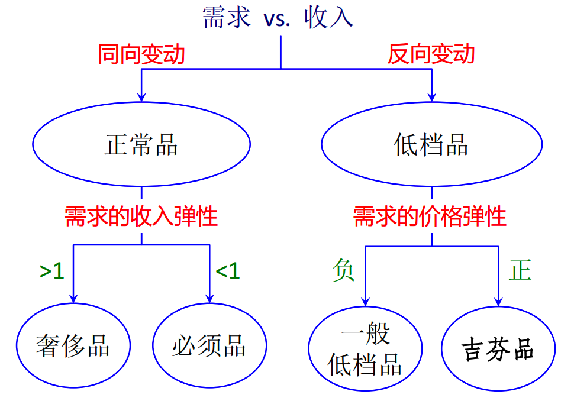
1. 商品需求量与收入呈反方向变化。
	1. 价格弹性为正，价格⬆️需求量⬆️：吉芬品
	2. 价格弹性为负，价格⬆️需求量⬇️：一般低档品
2. 商品需求量与收入呈同方向变化
	1. 收入弹性<1，必需品
	2. 收入弹性>1，奢侈品

### 4 . 弹性
1. 薄利多销（**需求的价格弹性大**）、谷贱伤农（**需求大价格弹性小**）
2. 斜率相等但弹性不一定相等
	
3. 替代品：**交叉价格弹性为正**
4. 互补品：交叉价格弹性为负

#### 4.1 需求弹性分析

##### 4.1.1 需求的价格弹性

1. 需求的价格弹性：表示在一定时期内当一种商品的**价格变化百分之一**时所引起的该商品的**需求量变化的百分比**。（如果价格弹性为负，一般取其绝对值）
2. 【计算】需求的价格弹性：$=\frac{需求量变动百分比}{价格变动百分比}$
3. <u>价格弧弹性</u>：**表示需求曲线上两点之间的需求量的变动对于价格的变动的反应程度**
4. 【计算】需求的价格弧弹性： $E_p=\frac{\Delta Q}{\Delta P}\frac{P_{平均}}{Q_{平均}}$
5. <u>价格点弹性</u>：**表示需求曲线上某一点上的需求量变动对于价格变动的反应程度**。
6. 【计算】需求的价格点弹性：$E_{p}=lim_{\Delta P\to 0}\frac{\Delta Q/Q}{\Delta P/P}= \frac{dQ}{dP}\cdot\frac{P}{Q}$
> [!example]+
> 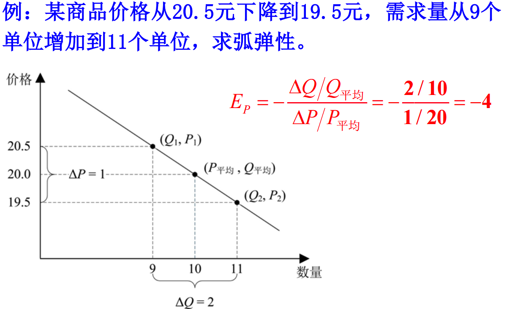

7. 需求价格弹性的分类
	1. **完全弹性**：弹性为无穷大。 
	2. **富有弹性**：弹性大于 1。
	3. **单位弹性**：弹性等于 1（需求曲线为双曲线）。 
	4. **缺乏弹性**：弹性小于 1。 
	5. **完全无弹性**：弹性为 0。
	
8. 尽管线性需求曲线斜率不变，但价格弹性可能会改变。
	
	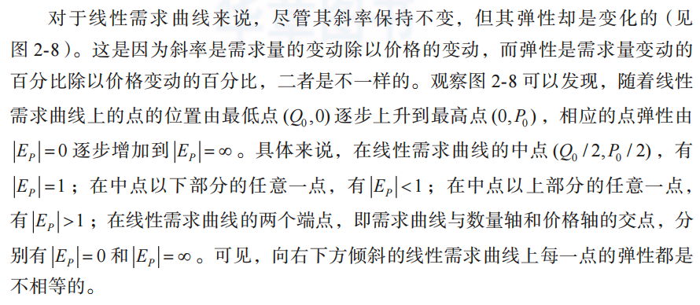

9. *需求价格弹性的影响因素*
	1. **商品消费支出占总支出的比重**
		**占比越大弹性越大**
	2. **商品对消费者生活的重要程度**
		**生活必需品价格弹性小，非必需品弹性大**
	3. **消费者调节需求量的时间**
		**时间越长弹性越大**
	4. **商品用途的广泛性**
		**用途越广弹性越大**
	5. **商品的可替代性**
		**替代品越多，相近程度越高，价格弹性越大****
	记忆方法：和网购很像：这个商品贵不贵（消费支出占比重）；是不是很重要（重要程度）；是不是急需（调节需求量时间）；可不可以多用/买一个可以应对好多问题（广泛性）；有没有别的商品可以干同样的活（可替代性）。

##### 4.1.2 需求的价格弹性的应用

1. 销售总收益 = 价格×销售量，**销售总收益的变动取决于商品需求的价格弹性的大小**
	1. 对于**富有弹性**的商品，销售总收益与商品的价格成**反方向的变动**。
	2. 对于**缺乏弹性**的商品，销售总收益与商品的价格成**同方向的变动**。
	3. 对于**单位弹性**的商品，降低价格或提高价格对厂商的销售总收益**都没有影响**。
	记忆方法：富有弹性——反比（因为富有所以要打压它）；缺乏弹性——正比（因为缺乏所以要补偿它）；单位弹性——无影响（单位，怎么变它都是那个样子）。

2. 【计算】分析价格和销售量
> [!example]+
> 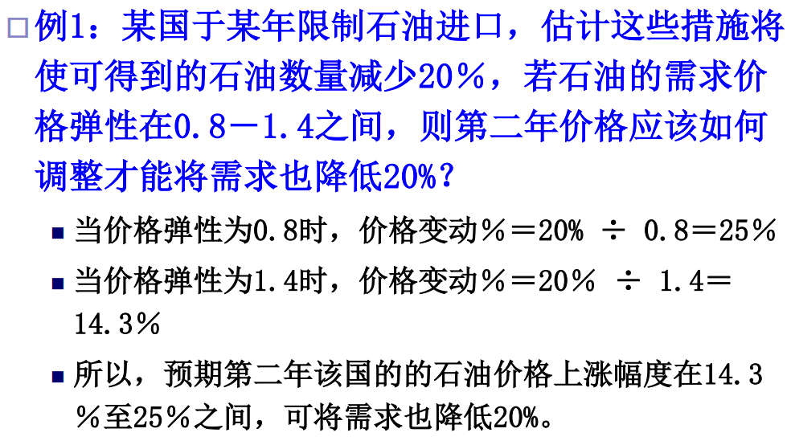
> 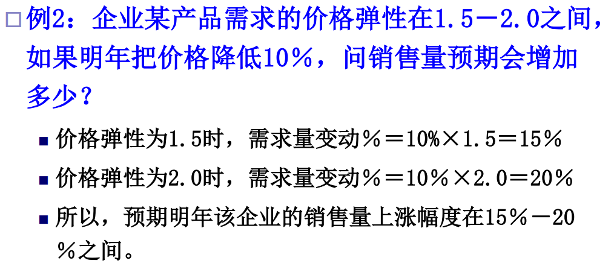

##### 4.1.3 需求的收入弹性

1. 需求的收入弹性：在一定时期内当消费者的**收入变化百分之一**时所引起的该商品的**需求量变化的百分比**。
2. 【计算】需求的收入弹性：$=\frac{需求量变动百分比}{收入变动百分比}$ 
3. 【计算】需求的收入弧弹性： $E_{I}=\frac{\Delta Q}{\Delta I}\frac{I_{平均}}{Q_{平均}}$ 
4. 【计算】需求的收入点弹性：$E_{I}=lim_{\Delta I\to 0}\frac{\Delta Q/Q}{\Delta I/I}= \frac{dQ}{dI}\cdot\frac{I}{Q}$
5. <u>收入弹性与商品的关系</u>
	1. **低档品收入弹性为负**——需求与收入反比
	2. **正常品收入弹性为正**——需求与收入正比
		**收入弹性小于 1，必需品；大于 1，奢侈品。**
	3. 食物支出收入弹性越小，越富裕（可参考恩格尔系数）。

> [!example]+
> 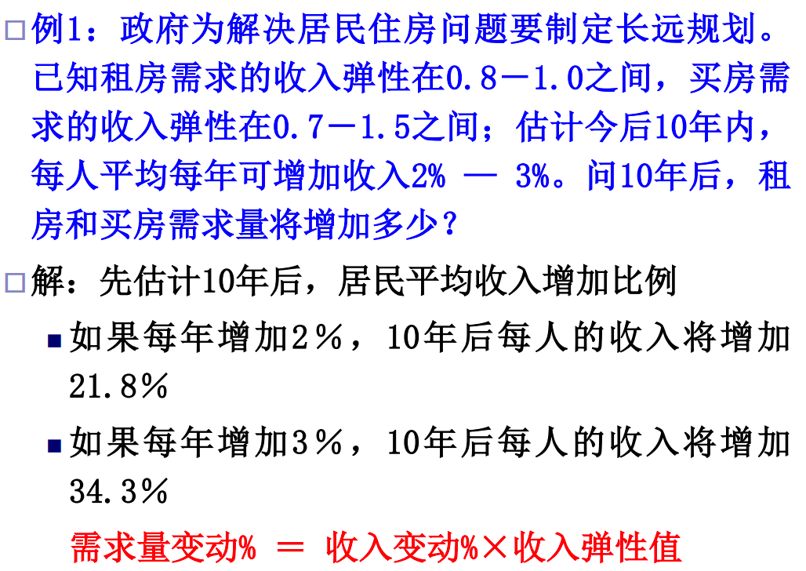
> 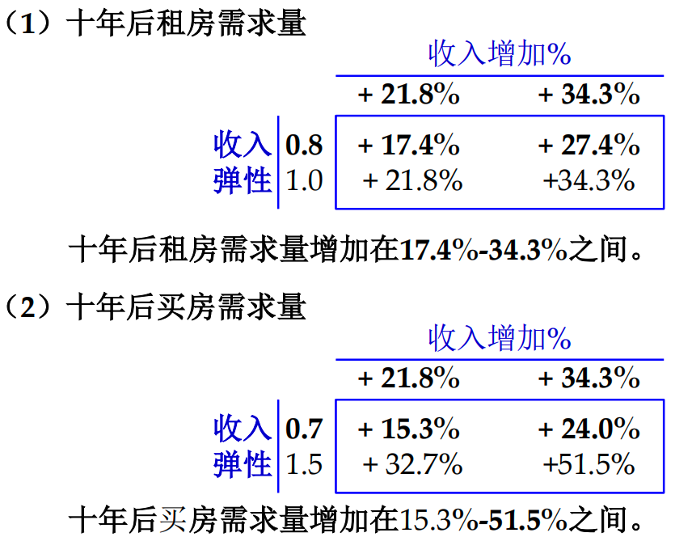

##### 4.1.4 需求的交叉价格弹性

1. 需求的交叉价格弹性：在一定时期内当一种商品的**价格变化百分之一**时所引起的另一种商品的**需求量变化的百分比**。
2. 【计算】需求的交叉价格弧弹性： $E_{XY}=\frac{\Delta Q_{X}}{\Delta P_{Y}}\frac{P_{Y}}{Q_{X}}$ 
3. 【计算】需求的交叉价格点弹性：$E_{XY}=lim_{\Delta P_{Y}\to 0}\frac{\Delta Q_{X}/Q_{X}}{\Delta P_{Y}/P_{Y}}= \frac{dQ_{X}}{dP_{Y}}\cdot\frac{P_{Y}}{Q_{X}}$

4. 交叉价格与商品关系（替代/互补）
	1. **互为替代品，则交叉价格弹性为正；**（苹果&梨）
	2. **互为互补品，则交叉价格弹性为负；**（汽车&汽油）
	3. **无关，交叉价格弹性为 0.**（食盐&蔗糖）

#### 4.2 供给弹性分析

##### 4.2.1 供给的价格弹性

1. 供给的价格弹性：**表示在一定时期内当一种商品的价格变化百分之一时所引起的该商品的供给量变化的百分比**。

2. 【计算】供给的价格弹性：$=\frac{供给量变动百分比}{价格变动百分比}$ 
3. 【计算】供给的价格弧弹性： $E_{S}=\frac{\Delta Q}{\Delta P}\frac{P_{平均}}{Q_{平均}}$ 
4. 【计算】供给的价格点弹性：$E_{S}=lim_{\Delta P\to 0}\frac{\Delta Q/Q}{\Delta P/P}= \frac{dQ}{dP}\cdot\frac{P}{Q}$

5. 供给的价格弹性的分类
	1. **完全无弹性**：弹性为 0。a
	2. **缺乏弹性**：弹性小于 1。b
	3. **单位弹性**：弹性等于 1。c
	4. **富有弹性**：弹性大于 1。d
	5. **完全弹性**：弹性为无穷大。e
	

6. *供给价格弹性的影响因素*
	1. **产量调整需要的时间**
		**时间越久弹性越大**
	2. **生产成本随产量变化的情况**
		**增产成本越低弹性越大**
	3. **商品生产周期长短**
		**生产周期越短弹性越大**

##### 4.2.2 供给的其他弹性

1. 供给的成本弹性：在一定时期内当生产的**成本变化百分之一**时所引起的该商品的**供给量变化的百分比**，**一般为负值**。
2. 供给的交叉价格弹性：在一定时期内当一种商品的**价格变化百分之一**时所引起的**另一种商品的供给量变化的百分比**。

### 5 . 市场均衡

1. 商品的均衡价格是商品市场上**需求**和**供给**这两种力量共同作用的结果，可在**市场供求力量的自发调节**下形成。
2. 供>求：商品过剩/**超额供给**
	
3. 供<求：商品短缺/超额需求/**供不应求**
	
4. <u>需求和供给变动对均衡的影响——供求定理</u>：在其他条件不变的情况下，**需求的变动分别引起均衡价格和均衡数量同方向的变动**；**供给的变动引起均衡价格反方向的变动，引起均衡数量同方向的变动**。
	1. 供给不变，需求↑，均衡价格↑均衡数量↑
	2. 供给不变，需求↓，均衡价格↓均衡数量↓
	3. 需求不变，供给↑，均衡价格↓均衡数量↑
	4. 需求不变，供给↓，均衡价格↑均衡数量↓
	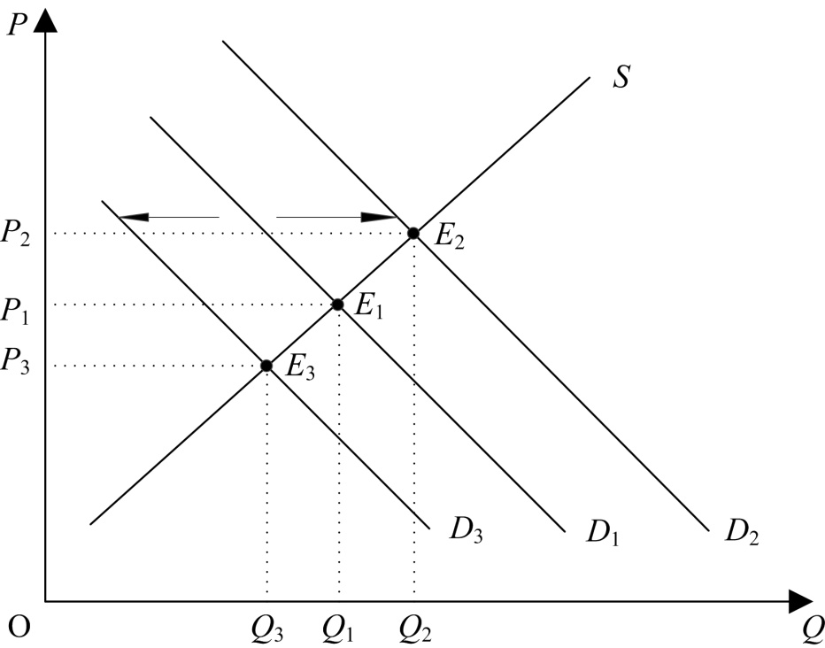
	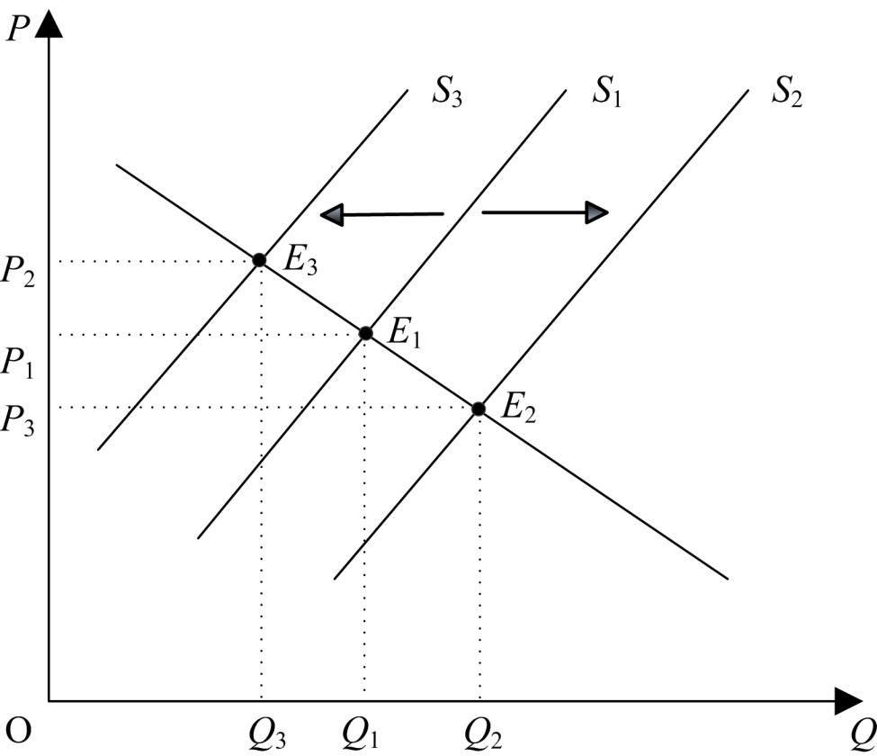

5. 税收是对于市场交易的单位商品**收取**生产者或消费者固定金额的货币。
6. 价格补贴是**对于市场交易的单位商品给予生产者或消费者固定金额的货币**。
7. 价格补贴和税收
	1. 只对生产者征税，**使生产成本提高，供给曲线左移，需求曲线不变，导致均衡价格上升，均衡数量减少**；
	2. 只对生产者补贴，**使生产成本降低，供给曲线右移，需求曲线不变，导致均衡价格下降，均衡数量增加**；
	3. 只对消费者征税，**使收入水平降低，需求曲线左移，供给曲线不变，导致均衡价格和数量都减少**；
	4. 只对消费者补贴，**使收入水平提高，需求曲线右移，供给曲线不变，导致均衡价格和数量都增加**。
	记忆方法：只对生产者征税/补贴，供给减少/增加；只对消费者征税/补贴，需求减少/增加。然后根据供给和需求曲线的变化趋势看均衡价格和数量即可。
8. 税收 / 补贴都由**斜率大（价格弹性小）** 的一方更多承担。
	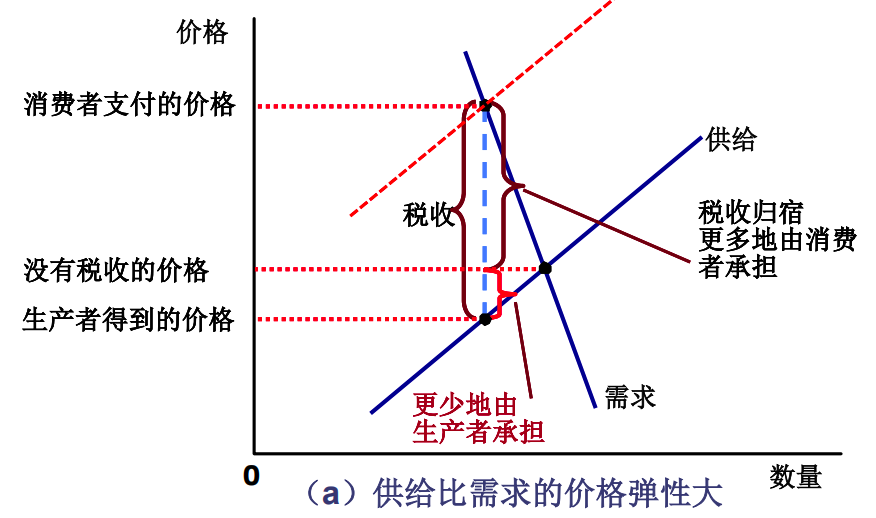
	

## 3 . 要素投入与市场结构

### 1 . 生产函数

1. 【计算】道格拉斯生产函数 $Q = AL^{\alpha}K^{1-\alpha}$ 
	Q——产出量；L——劳动力投入量；K——资本投入量；A 、 α——待定参数
2. <u>边际报酬递减律</u>：在技术水平不变的条件下，若连续等量地把某一种可变生产要素增加到生产系统而维持其他生产要素的投入不变，那么**当这一要素总投入量超过某个临界值时，增加该要素一个单位的投入，其边际产量（注意：不是总产量）会逐渐减少。**
	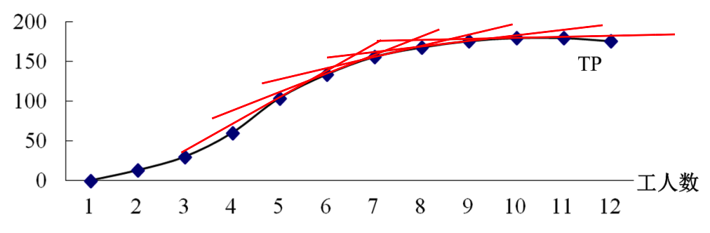
3. <u>规模报酬</u>：因为**要素的投入规模变化**而导致的**产量的变动**称为规模报酬。
	1. 规模报酬不变：投入比例 = 产出比例
	2. 规模报酬递增：投入少，产出多
	3. 规模报酬递减：投入多，产出少
	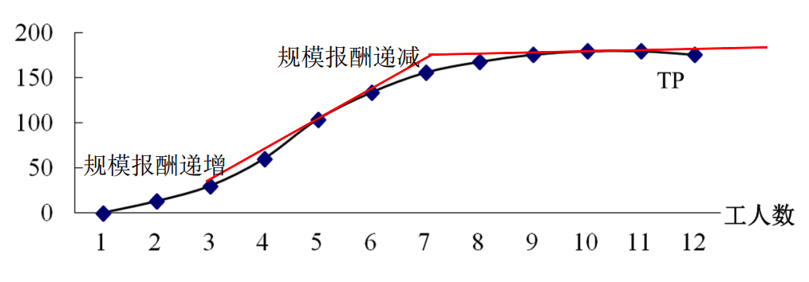

4. <u>等产量线</u>：**产量相等的生产要素组合**形成的曲线，即**总产量函数的等高线/等值线**。
	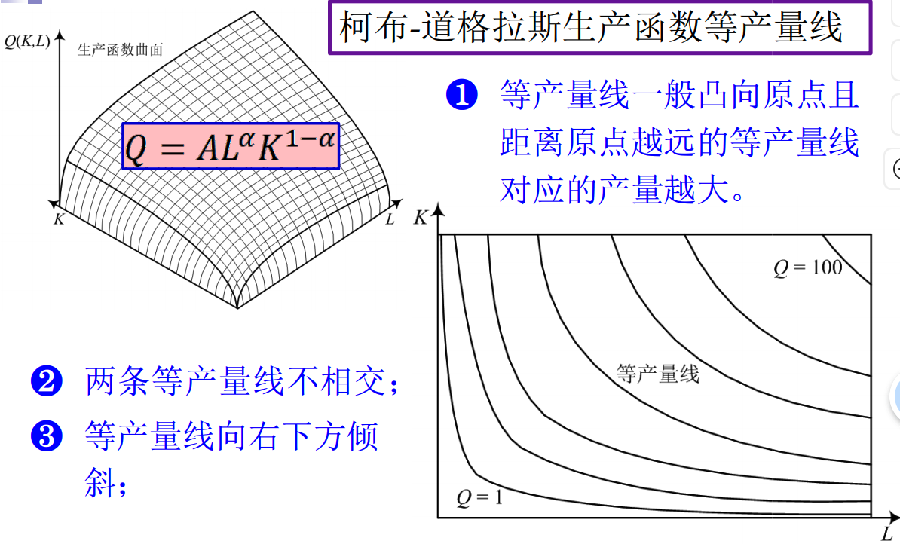

6. 生产要素可替代性：
	1. 完全相互替代：等产量线是直线
		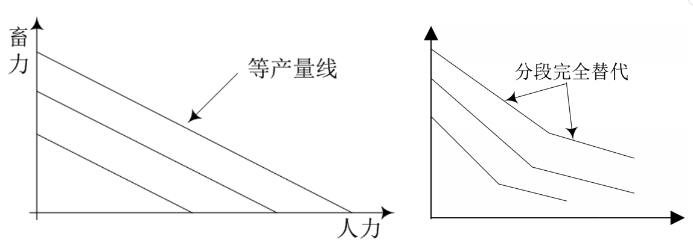
	2. 不完全替代：等产量线是曲线
		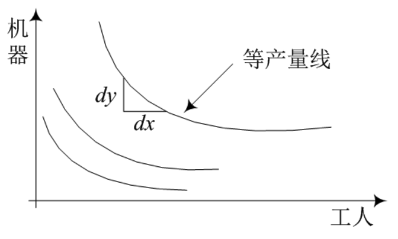
	3. 完全不能替代：等产量线是直角折线
		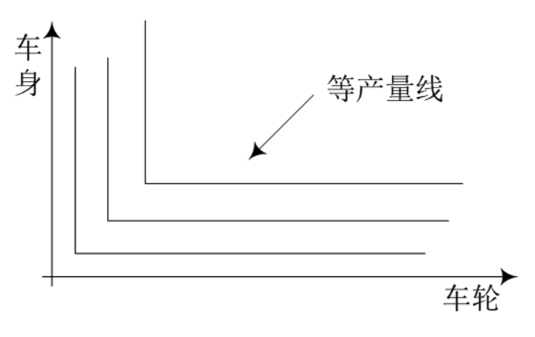
7. 【计算】<u>边际技术替代率</u>：等产量线上两种生产要素变化量之比 $MRS = \frac{dy}{dx} = \frac{MP_{x}}{MP_{y}}$。
> [!example]+
> 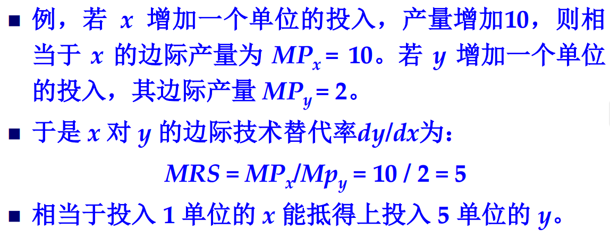

### 2 . 投入要素最佳组合

1. 等成本线：给定预算 C，要素 x、y 的购进价格分别为 $P_x$、$P_y$，那么所采购的最大要素量需满足预算约束：$P_{x}x+P_{y}y = C$ ，该方程称为等成本线
	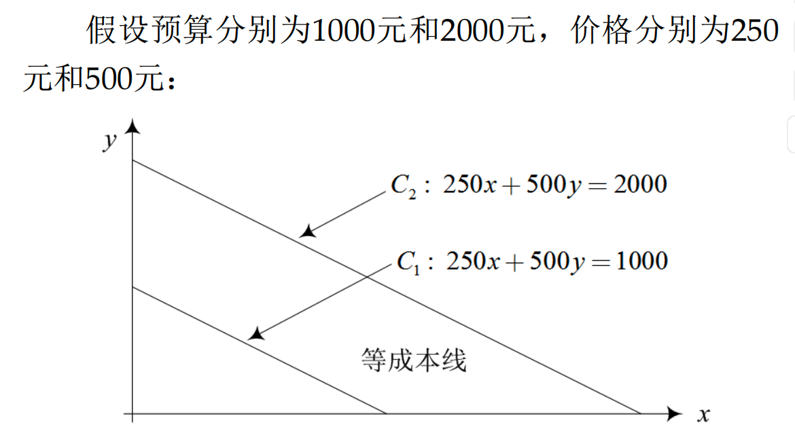
2. 【计算】产量最大决策（固定成本）：已知生产函数、生产要素价格，**给定预算总成本**，如何确定生产要素投入量使得产量最大？找一条等产量线使给定预算的等成本线相切
	$\frac{MP_{x}}{P_{x}} = \frac{MP_{y}}{P_{y}}$
3. 【计算】成本最小决策（固定产量）：已知生产函数，生产要素价格，如何以最小成本达到给定的目标产量？找一条等成本线，使之与给定的等产量线相切，切点就是生产要素最佳组合点
	$\frac{MP_{x}}{P_{x}} = \frac{MP_{y}}{P_{y}}$

> [!example]+
> 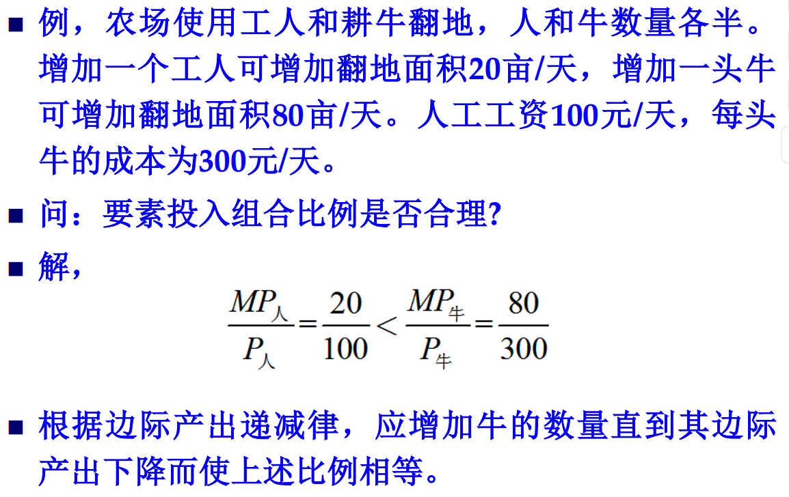
> 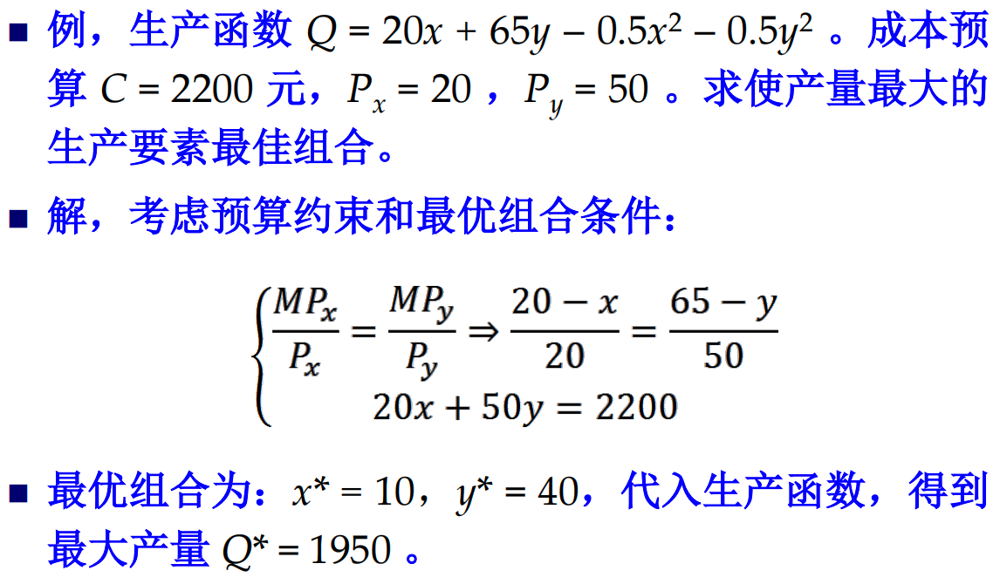

### 3 . 成本与利润

#### 3.1 成本

##### 3.1.1 基本概念

1. <u>产品成本</u> = **物化成本** + **工资**
2. <u>产品价值</u> = **产品成本** + **利润和税金**

3. <u>总成本</u>：**固定成本**和**变动成本**之和。 $TC = F + vx$
4. <u>固定成本</u>：在**一定期间**和**一定生产规模限度**内，**不随产量变动而变动**的成本。 $F$
5. 变动成本：**随着产量变化而变动**的那部分成本。 $vx$
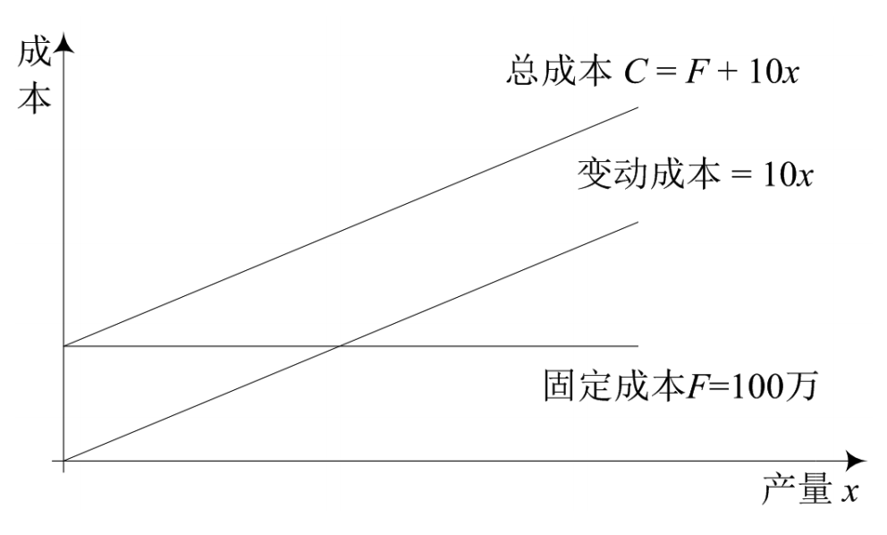
6. 短期成本分为**固定**和**变动**两部分，长期成本都是**变动成本**。

7. 机会成本：**在一种资源用于某种用途而放弃用于其他用途所丧失的潜在利益**。
8. <u>会计成本</u>：**会计系统的账面成本**，反映了**生产者在某一时期内所发生的实际的费用或者支出**

9. 沉没成本：**过去**发生的费用支出，**不是现在或者将来任何决策**所能改变的成本。

##### 3.1.2 成本函数

1. <u>成本函数</u>：**技术水平**和**要素价格**不变的条件下，**成本与产出**之间的相互关系，称为成本函数。 $TC=C(x)$
2. 边际成本：**增加单位产量而引起的成本增加**。 $MC$ 
3. **平均成本线 AC 和边际成本线 MC 的交点**，是平均成本的最低点。

#### 3.2 利润函数与生产决策

1. 利润函数：$TR(x)-TC(x)$
2. 收益：$TR(Q) = P\cdot Q$
3. 利润最大的必要条件：**边际收益 MR = 边际成本 MC**。
	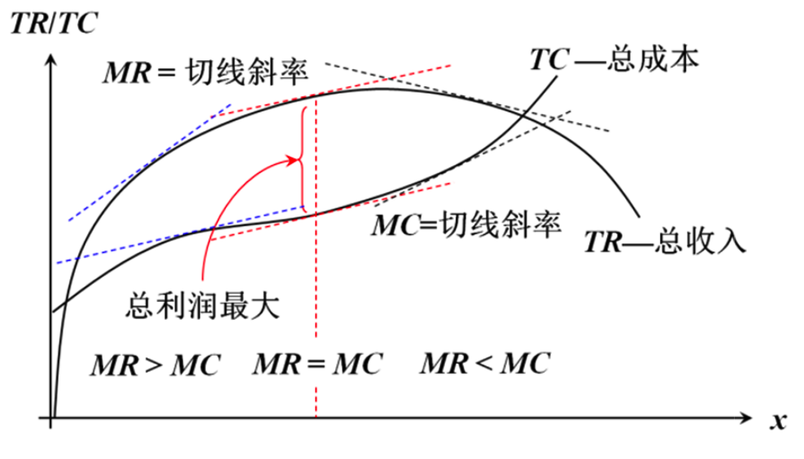
4. 【计算 / 大题】成本函数 / 利润决策。
> [!example]+
> 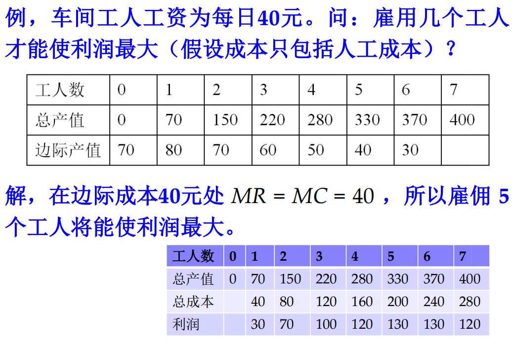
> 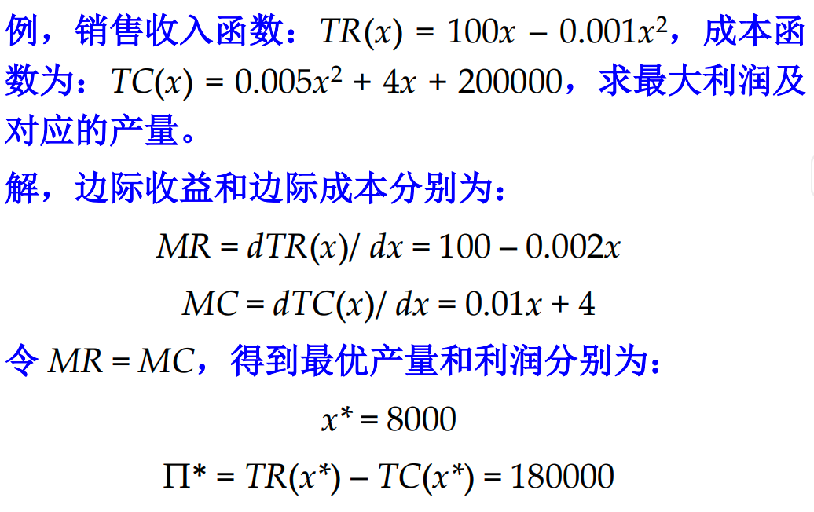

5. 完全竞争市场的边际收益 MR 等于市场均衡价格 P，因此利润最大的必要条件是：**MC ＝均衡价格 P** 。
6. 对线性收入和成本函数，边际收入和边际成本不变（要么 MR 恒大于 MC，要么恒小于，要么恒等），利润最优条件 P＝MC 不一定成立，此时宜结合产能限制和实际需求量/销售量来确定最优产量。
7. **产量最大不一定对应利润最大**。
	记忆方法：最优产量对应最大利润，但最优不一定最大。

### 4 . 市场结构与生产决策

1. 市场结构：**买主和卖主数量的多少、产品之间相互差异的程度以及新的生产者进入市场的难易程度**。
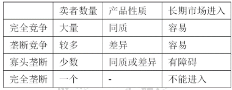
2. 完全竞争：价格由市场定，企业无法左右市场。
3. 垄断竞争：有较多的同类产品提供者，但是他们的产品具有差异并可以相互替代。
4. 寡头垄断：比垄断竞争的产品供应者更少，特点是，一个寡头的决策会影响其它寡头，但同时也被其它寡头的决策所影响，形成了博弈结构。
5. 完全垄断：只有一个巨头，可通过调整价格（产销量也会同时调整）以实现自己的利润最大化。

6. 完全竞争市场：**产品价格 P** = **边际收益 MR** = **边际成本 MC**
	1. <u>短期供给曲线</u>，**MC 大于 AVC**
		**边际成本 MC 位于平均变动成本 AVC 线以上**的增函数部分
		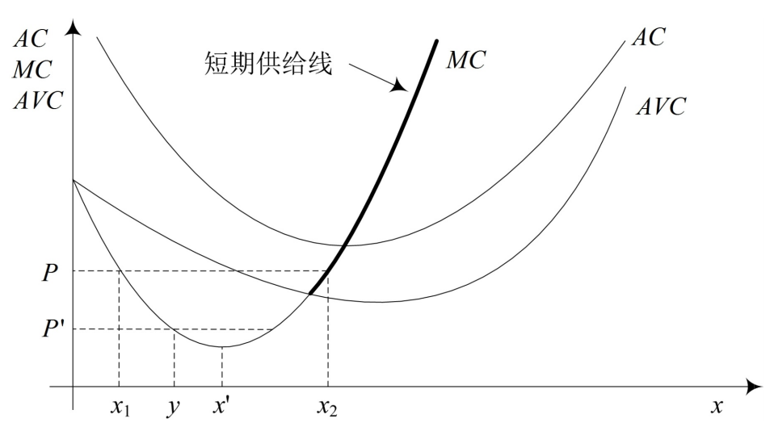
	2. <u>长期供给曲线</u>，**LMC 大于 LAC**
		**长期边际成本线 LMC 位于长期平均成本 LAC** 之上的部分
		
7. 完全垄断市场
	1. 垄断价格高于**边际收益和边际成本**
	2. 垄断价格高于**完全竞争均衡价格**
	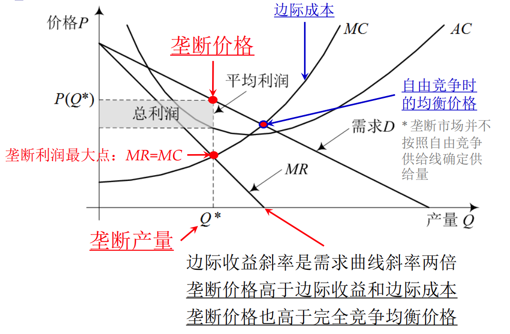

8. <u>帕累托改进</u>：**不损害别人利益**的情况下，使**某个或某些人利益增加**。
9. <u>帕累托最优</u>：一种系统状态，在该状态下，**不存在一种方案能实现帕累托改进**。
10. 垄断产量不是社会资源的帕累托最优配置，因为存在帕累托改进
11. 垄断使**企业**处境好，竞争使**消费者**处境好, <u>反垄断</u>，有利于**社会总收益**最大。
	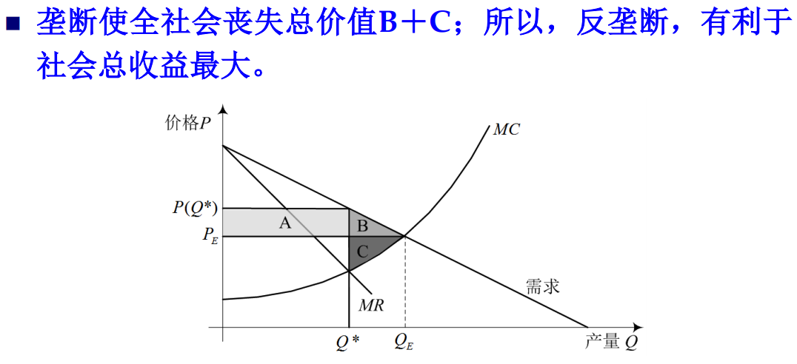

### 5 . 市场失灵

1. <u>市场失灵的原因</u>：**不完全竞争**、**产品外部性**、**非对称信息/不完全信息**、**公共产品问题**。
	**不完全竞争**：垄断
	**非对称信息/不完全信息**：次品问题和劣选择（劣币驱逐良币）、道德风险（骗保）、委托-代理问题（经理摸鱼，不好好给老板打工）
	**公共产品问题**：马路、公园等不能单纯依靠市场机制而提供或调节
	1. 需求量很大，但市场机制的提供者可能很少。
	2. 可能导致“公地悲剧/大锅饭悲剧/公共资源悲剧” ：需要建立起来一套制度或者一个中心化的权力机构解决。
2. **外部性**
	

## 4 . 宏观经济分析

### 1 . 宏观经济学概述

1. <u>宏观经济学</u>：宏观经济学是以**整个国民经济活动**为研究对象，主要研究**国民收入**、**社会就业**、**物价水平**、**经济增长速度**、**经济周期波动**等全局性的问题。
2. <u>宏观经济学研究对象</u>：**总产出**、**通货膨胀**、**失业**、**宏观经济政策**

### 2 . 国内生产总值

1. <u>国内生产总值</u>（GDP）：在**一个国家的国土面积**上，在**一定时期**内**生产**的所有**最终产品和劳务**的市场价值，它**既衡量总支出又衡量总收入**。

2. GDP 核算方法：**生产法**、**收入法**、**支出法**
3. <u>中国 GDP 曾经的“三驾马车”</u>：**消费**、**投资**、**净出口**。
4. 支出法 GDP = **消费 C** + **投资 I** +**净出口 NX** + **政府购买 G**
	1. 消费：居民个人除**购买新住房**和**建造住宅**之外用于最终产品和劳务的支出。
	2. 投资：一段时期内的**建筑物**、机械设备、**存货**等资本存量增加部分的支出。
		**购买新住房**和**建造住宅**属于投资
		考试时这一部分主要是存货。不包含**金融投资**
	3. 净出口：出口额 - 进口额。
	4. 政府购买：各级政府购买最终产品和劳务的支出。
		**政府支出**<u>包括</u>**政府购买**、**转移支付**（如政府对残疾人和失业者发放的救济金等）和**支付公债利息**，后两个不算 GDP

5. 【计算】$名义GDP=当期产量 \times 当期价格$ 
6. 【计算】$真实GDP=当期产量 \times 基期价格$ 
7. 【计算】$GDP平减指数=\frac{名义GDP}{真实GDP} \times 100$ 
8. 【计算】$实际GDP增长率=\frac{当年的实际GDP-前一年的实际GDP}{前一年的实际GDP} \times 100 \%$

### 3 . 失业与通货膨胀

#### 3.1 失业

1. 劳动力人口-非劳动人口
	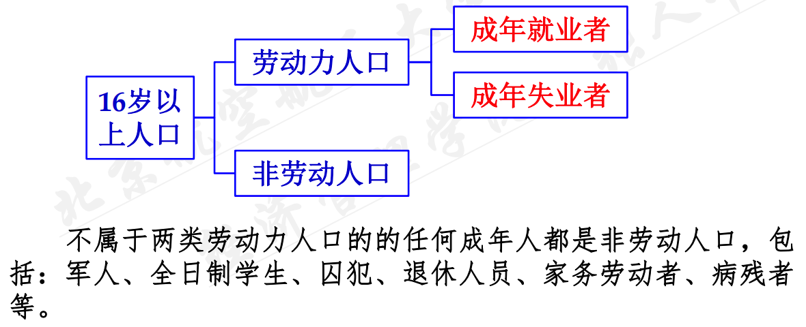
2. <u>失业的种类</u>，根据例子进行判断
	1. **自愿失业**：劳动者因为**自身原因不愿接受工作**而形成的失业。
		不愿意接受现行工资、大学毕业后的“gap year”等
	2. **非自愿失业**：**愿意接受工作但仍找不到工作**的失业。
	3. **周期性失业**：因**需求下降而造成**的失业，它是因**整个经济的支出和产出下降**而造成的。
		- 经济萧条，居民没钱买车，车企销量暴跌，大规模裁剪生产线工人；
		- 经济下行，大家减少旅游、聚餐，酒店、餐饮批量裁员；
		- 金融危机后，房地产成交量大跌，建筑工人、房产中介集体失业。
	4. **摩擦性失业**：是指在生产过程中由于**难以避免的摩擦**（劳资纠纷等）造成的**短期、局部性**失业，常起源于劳动力的供给方；
		- 应届生刚毕业，投递简历、面试空档期暂时没工作；
		- 上班族嫌薪资低主动辞职，在家休整 1–2 个月找新工作；
		- 搬家到另一座城市，离职后重新寻找本地岗位；
	5. **结构性失业**：是指**经济结构变化**等原因造成的失业，结构性失业具有**长期性**，常起源于劳动的需求方。
		- 技术进步诞生了新产业，淘汰了旧产业；但旧产业的员工跟不上技术发展，新产业中的企业又不能雇佣这些老员工而造成结构性失业。
		记忆方法：周期性失业是趋势原因，摩擦性失业是指干活的人（雇员）不高兴，结构性失业和雇主有关。
	6. **自然失业**： **= 摩擦性失业+结构性失业**。
	7. 只有**自然失业**的状态称为**充分就业**。

#### 3.2 通货膨胀

1. 通货膨胀：一个经济体中的**大多数产品和劳务的价格**在一段时间内**持续普遍上涨**的一种现象。

2. 【计算】消费物价指数（CPI）：$CPI=\frac{一篮子固定商品按当期价格计算的价值}{一篮子固定商品按基期价格计算的价值} \times 100\%$ 不包括房价
3. 【计算】<u>通货膨胀率</u>：$第t年通货膨胀率=\frac{第t年CPI-第t-1年CPI}{第t-1年CPI} \times 100\%$
4. <u>批发价格指数 WPI</u>（工业生产者价格指数）：**大宗物资批发价格加权平均**得到的价格指数，包括原料、中间产品、最终产品和进出口品，**但不包括劳务**。
	记忆方法：大宗物资，不包括劳务。
5. 【计算】GDP 平减指数

6. <u>通货膨胀种类</u>
	1. **温和的通货膨胀**：年通胀率**在 10%以内**
	2. **奔腾的通货膨胀**：年通货膨胀率**在 10%到 100%之间**
	3. **超级通货膨胀**：年通货膨胀率**超过 100%时**
	4. **恶性通货膨胀**：**月通货膨胀率超过 50%**（对应的年通胀率可达 12975%）
	
	5. 平衡的通货膨胀：所有商品的价格以同比例上升
	6. 非平衡的通货膨胀
	
	7. 未预期到的通货膨胀
	8. 预期到的通货膨胀

### 4. 经济周期与宏观经济政策

1. <u>经济周期</u>：又叫商业周期、商业循环，指国民**总产出**、**总收入**和**总就业**相对于它们的潜在水平的波动。
	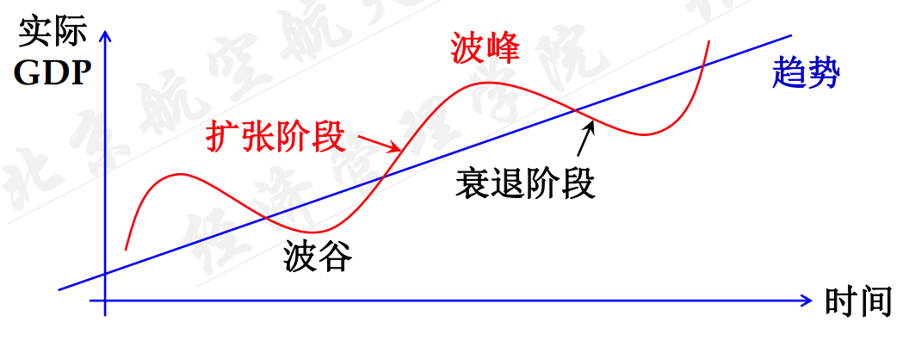
	记忆方法：总产出、总收益、总就业的波动。
2. <u>经济周期的原因</u>：**内因论**（**货币主义经济周期理论**、**投资过度理论**和**心理预期理论**）、**外因论**、**综合论**。
3. <u>宏观经济政策是政府为了达到</u>**就业水平**和**物价水平**的均衡状态，实现整体经济**健康平稳发展**而对经济活动进行**有意识的干预**
4. <u>宏观经济政策目标</u>：**充分就业**、**价格水平稳定**、**经济持续均衡增长**、**国际收支平衡**。

5. <u>财政政策</u>：国家通过调节**政府支出和收入**水平（如税收和借债水平）以影响总需求状况，进而达到保持经济的持续增长和高就业率目的而采取的宏观经济政策。
	1. <u>政府支出</u>：**政府购买**、**政府转移支付**和**政府债券利息支付**。
	2. <u>政府收入</u>：**税收**（无偿性、强制性、固定性， 占财政收入的 80%）和**政府公债**
	3. **逆风行事**：
		1. 不景气-刺激需求的扩张性财政政策（政府购买⬆️转移支付⬆️税收水平⬇️）
		2. 经济过热-抑制需求的紧缩性财政政策

6. <u>货币政策</u>：**中央银行**通过控制**货币市场中货币供应量**、以及**调节利率**进而影响投资和整个经济支出以达到一定经济目标而采取的宏观经济政策。
	1. <u>货币政策工具主要包括</u>**法定准备金**、**公开市场业务**和**再贴现率**。
	2. **法定准备金**：中央银行规定的商业银行及其他金融机构根据其存款量**必须缴存于中央银行的最低准备金量**
	3. **公开市场业务**：中央银行在金融市场上公开**买卖政府债券**（不是新发行）以控制货币供给量。
	4. **再贴现率**：中央银行对商业银行及其他金融机构**发放贷款的利率**
	5. **逆风行事**
		1. **经济衰退** - **扩张性的货币政策** - **增加货币供给** - 以防止出现通货紧缩 - 法定准备金⬇️、公开市场业务⬇️、再贴现率⬇️
		2. **经济过热** - **紧缩性货币政策** - **减少货币供给** - 以防止出现通货膨胀 - 法定准备金⬆️、公开市场业务⬆️、再贴现率⬆️

## 5. 管理学概述

### 1 . 经济与管理的基本概念

1. <u>*管理*</u>：管理者在**动态环境**下通过对**组织内部资源及整合的组织外部资源**进行有效**计划、组织、控制和领导**以实现**组织目标**的**科学和艺术过程**。
	记忆方法：管理是动态的而不是一成不变的，通过内外资源结合来使用四大职能来实现目标的科学和艺术（既是一门科学又是一门艺术）的过程。
2. 管理的基本职能：**计划**、**组织**、**领导**、**控制**。
	记忆方法：先制定计划，计划好之后开始组织人来实现计划，再确定一个领导者，工作过程中要注意控制在正常范围内。
	1. **计划职能**：<u>管理者对</u>**组织的目标和应采取的行动方案**做出**选择和具体安排**的活动过程。
	2. **组织职能**：<u>管理者根据</u>**计划制定的目标**，对组织中的**各种要素**包括人力资源之间的相互关系进行**合理配置**过程。
	3. **领导职能**：<u>管理者为了实现组织目标而</u>**对被管理者施加影响**的过程。
	4. **控制职能**：<u>管理者运用事先确定的标准</u>，衡量实际工作绩效，寻找**偏差及其产生的原因**，并**采取措施予以纠正**的过程。
3. 管理者角色：**基层管理者**、**中级管理者**、**高层管理者**。
4. 管理者技能：**概念技能**、**人际技能**、**技术技能**。
	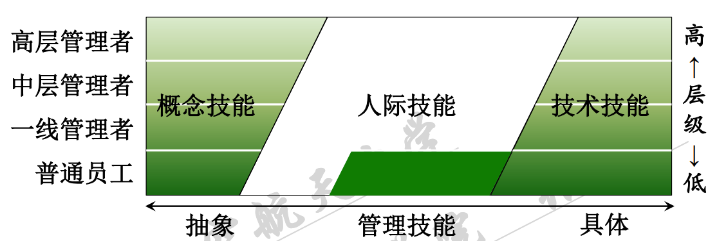
	记忆方法：高层的人要注意概念（方便用定义来洗脑），人际技能都需要（都要沟通），基层管理者就是要干技术活（技术技能）。
5. *管理者工作内容*：**传统管理**、**沟通**、**人力资源管理**、**网络联系**。
	记忆方法：传统的管理、管理有人际技能那就需要沟通，再扩大下去就是人力资源管理。与时代结合，于是需要网络联系。

### 2. 现代管理思想的演变
1. 泰勒-**科学管理**之父
2. 马斯洛层次需求理论：**生理需要**、**安全需要**、**情感与归属感需要**、**尊重需要**、**自我实现需要**
	

3. **吉尔布雷斯**：<u>*动作研究*之父</u>。侧重工人作业*动作分析*，通过分解、简化、优化操作动作消除无效动作，配套疲劳研究，奠定*工业工程动作分析基础*。
4. **亨利 · 法约尔**：*管理过程*之父，提出*管理五大职能：计划、组织、指挥、协调、控制*（把领导拆成了指挥和协调），同时总结 *14 条管理原则*，构建古典管理学派框架。
5. **霍桑实验**：测定*各种因素*对生产效率的影响。哈佛大学在霍桑工厂开展系列实验，初衷研究照明、薪酬、休息时间等物理、经济条件对生产效率的影响，最终意外发现*人的社会、心理因素作用远大于物质条件*。
6. **梅奥**：人际关系学说。*霍桑实验*主导者，基于实验提出*人际关系学说*：工人是 “*社会人*” 而非经济人；企业存在非正式组织；士气决定生产效率，*开创行为科学管理学派*。
7. **麦格雷戈**提出 *X-Y 理论*，即 X、Y 两种对立人性假设：
	- X 理论：经济人假设，认为人天生懒惰、被动，必须强制管控；
	- Y 理论：持积极人性观，认为人愿意主动工作、自我约束、承担责任，是麦格雷戈主张推崇的管理观点。
8. **泰勒**的科学管理原则：
	1. 工作定额原理：根据动作研究和时间研究确定合适的标准劳动定额；
	2. 挑选和培养工人：每个人都有自己合适的工作岗位，管理者有责任针对工人特长分配他们做适合的工作，并且应该对工人进行培训以提高专业技能；
	3. 标准化原理：工作环境、操作方法、使用的工具必须统一和标准化；
	4. 差别计件工资制：效率越高的工人，给予其单位产出的报酬越高；
	5. 计划和执行职能必须分开：管理专业化，计划和执行职能必须分开；
	6. 实行职能工长制：工长应成为工人的老师、朋友、建议者，帮助工人进步；
	7. 例外原则：经理人员应该着重处理最好和最差的事情，不能羁绊与日常事务。
9. 行为科学管理学派主要关注**人际关系、积极性及创造性**等问题，而科学管理学派主要关注**制度、方法及效率**等问题

## 6 . 管理的职能

1. 管理四大职能：**计划**  **组织**  **领导**  **控制**

### 1. 计划

1. 计划工作中很重要的一个程序就是**确定目标**。
2. <u>目标管理的要点</u>：**明确目标**、**参与决策**、**规定时限**、**评价绩效**
	记忆方法：目标管理首先要知道目标是什么（**明确目标**），然后开始制定决策（**参与决策**），还要规定 ddl 以防效率过低（**规定时限**），做完之后需要评价成绩和效率（类似于考试，**评价绩效**）
3. <u>目标管理的程序</u>（步骤）：**建立一套完整的目标体系**、**明确责任**、**组织实施**、**检查和评价**。
	记忆方法：先要建立框架（**体系**），然后给每个人安排合适的工作（**明确责任**），再让每个人去干活（**组织实施**），最后对成果进行检查。
4. <u>目标管理应遵循</u>**SMART 原则**：**明确性（Specific）**、**衡量性（Measurable）**、**可实现性（Attainable）**、**相关性（Relevant）**、**时限性（Time-based）**

### 2 . 组织

1. <u>*组织的三要素*</u>：**目标、人、结构**
	记忆方法：一个组织要有合适的目标，还要有人来构成合适的结构从而实现目标。
2. <u>*组织职能过程*</u>：**职位设计**、**部门划分**、**职权配置**、**人力资源管理**、**协调整合**、**组织变革**。
	记忆方法：既然是职能过程，肯定和“职”有关，首先要进行的就是职位的设计。单个职位设置之后，需要分门别类，即为部门划分。部门有了，要分配权力，就是职权配置。有了职权，就可以招人，进行人力资源管理。人招够了，需要对整体进行协调整合。同时，需要根据具体情况进行更新和做出改变，即为组织变革。
3. <u>组织设计需要考虑的因素</u>：**管理层次与跨度**、**工作专业化**、**部门化**、**命令链**、**集权与分权**、**正规化**
	记忆方法：根据组织职能，需要进行人力资源管理（管理跨度）、职位设计（每个职位有对应的专业，就是专业化）、部门划分（部门化）、职权配置（权力是层层递进的，产生了命令链；同时需要对权力进行集合和划分，就是集权与分权）、协调整合和组织变革（为了组织更加整体化，更正规化）。
4. 管理跨度与组织层次成反比。跨度越宽层次越少，跨度越窄层次越多。
	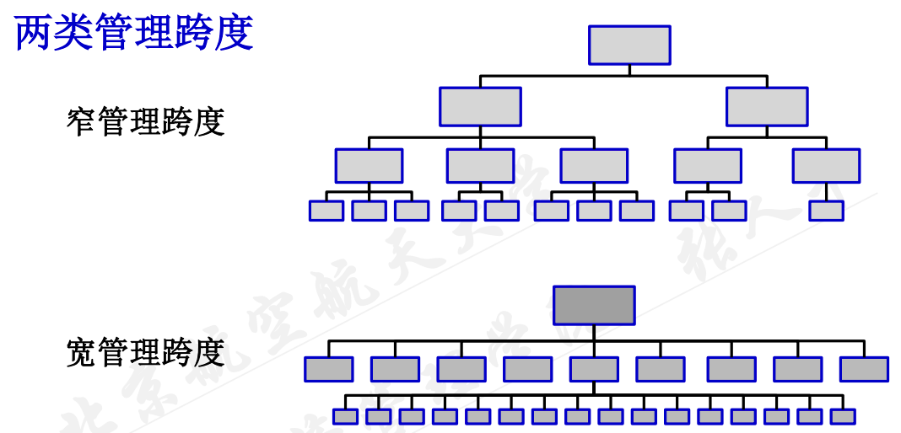
5. <u>组织结构类型</u>：**简单直线制**、**职能制**、**直线职能制**、**委员会制**、**矩阵制**、**事业部制**、**多维立体制**、**柔性组织和组织创新**

### 3 . 领导

1. <u>沟通的四要素</u>：**发送人**、**接收人**、**信息**和**渠道**。
	记忆方法：**发送人通过一些渠道把信息传递给接收人**。
2. 如何激励员工是领导职能的一个核心。
3. 激励理论：马斯洛层次需求理论、双因素理论……
	1. 马斯洛需求层次理论：**生理需求**、**安全需求**、**情感与归属感需求**、**尊重需求**、**自我实现需求**
		
	2. **赫茨伯格**<u>双因素理论</u>：**保健因素（基本）** 和**激励因素（进一步）**。
	3. **麦克利兰**<u>需求理论</u>：**成就需求**、**权力需求**、**归属需求**。
		记忆方法：**成就会激励人，显著的成就可能会让人拥有权力，由此产生权力的归属问题**
	4. **亚当斯**<u>公平理论</u>：**个人所得报酬 / 个人的投入 = 另一个人的报酬 / 另一个人的投入**。
	5. **弗鲁姆**<u>期望理论</u>：**激励 = 效价 × 期望。**

### 4 . 控制

## 7 . 企业与管理

### 1 . 企业与现代企业制度

1. <u>*企业*</u>是指从事商品生产、流通及服务性活动，满足社会需要并获取利润，**实行自主经营**、**自负盈亏**、**自我发展**、**自我约束**，独立享受权利和承担义务的法人型或非法人型的基本经营单位，具有**法人资格**。
	记忆方法：**自主经营**、**自负盈亏**、**自我发展**、**自我约束**。
2. 企业发展的三个阶段：**工场手工业**、**工厂生产**、**企业生产**
3. 企业的产生晚于管理

4. <u>企业的类型</u>，按照企业的法律形式分类：**独资企业**（**非法人型独资企业**、**法人型独资企业**）、**合伙企业**（**普通合伙企业**、**有限合伙企业**）、**公司制企业**（**股份有限公司**、**有限责任公司**）、**合作制企业**。

5. 独资企业
	1. 非法人型独资企业：*个人资产和企业资产没有差别，对债务承担无限责任*。
	2. 法人型独资企业：企业仅需以*法人资产*对其债务承担*有限责任*，而与企业所有者的*私人财产*无关。
6. 合伙企业：*由两个或两个以上的出资者共同出资创建*，实行联合经营和控制的企业。
	1. 普通合伙企业：*负无限连带责任*。
	2. 有限合伙企业：*普通合伙人+有限合伙人，上限 50 人*。普通合伙人负无限连带责任，有限合伙人以其*认缴的出资额*为限对企业债务承担有限责任。（*合伙企业数量较少：律师事务所、会计事务所、投资咨询机构*）。
7. 公司制企业
	1. <u>最基本的公司组成包含三个利益方</u>：**股东**（公司所有者）、**董事会**、**高层管理者**。股东掌控公司发展方向和选举董事会成员，然后董事会选举/招聘高层管理人员。高层管理人员负责公司运营，为股东赚取利润。
	2. 股份有限公司：已上市。
		1. 注册资本由*等额股份*构成，通过*发行股票筹集资本*，股东以认购的股份为限对公司承担有限责任，公司以其全部资产对公司债务承担责任的企业法人。
		2. 法律规定，公司的*股东人数最少为 2 人*，没有上限，因此*筹资能力极强*。
		3. 股份公司的*股份可自由转让*，投资主体可以非常分散，社会化程度很高。
	3. 有限责任公司：未上市。
		1. *由不超 50 人的股东出资*，每个股东以其所*认缴的出资额*为限对公司承担有限责任，而公司以其全部资产对公司债务承担责任的企业法人
		2. 有限责任公司*不公开发行股票*，*严格限制股权转让*，其筹资能力比股份有限公司弱，社会化程度较低
8. 合作制企业
	1. 一种契约式合营的经济主体，合营各方的持股结构并*不一定按照出资比例折算*，其利润分配、权利义务、风险承担等也不按出资比例分配，而是*通过协商以合同的方式确定*。
	2. 农村供销合作社：红利分配权重不仅限于出资额，还和劳动付出有关，使劳动和股本共同参与分配，实现了按劳分配与按股本金分配的有机结合。

### 2. 现代企业制度（简单看一下）

1. 企业制度：**企业产权制度**、**企业组织制度**、**企业管理制度**。

2. 现代企业制度
	1. **产权制度**：公司法人产权制度，规定*出资者的所有权*和*法人财产权*相互分离，是现代企业制度的核心。
	2. **法人制度**：保证企业*所有权和经营权分离*，包括：股东大会（重要人事和重大事项决定权）、董事会（企业的法定代表和决策者，由股东大会选举）、监事会（与董事会并列，对股东大会负责）、管理层（以总经理为首的执行机构，对董事会负责）。
	3. **有限责任制度**：降低出资人财产风险，利于筹资。
	4. **管理制度**：基于科学的管理原理和方法，对现代企业的整体管理活动进行的计划、组织、领导和控制

3. 现代企业制度的特点：**产权清晰**、**权责明确**、**政企分开**、**管理科学**。

### 3 . 企业的主要管理活动

1. <u>企业战略</u>是指企业在激烈的市场竞争环境中，在总结历史经验，调查现状、预测未来的基础上，为谋求生存和发展而做出的**长远性**、**全局性**的谋划或方案。
2. <u>营销组合理论</u>：
	1. 4P 理论：**产品（product）**、**价格（price）**、**地点（place）**、**促销（promotion）**；
	2. <u>4C 理论</u>：**顾客的需要和欲望（consumer needs and wants）**、**顾客的成本（cost to consumer）**、**便利（convenience）**、**沟通（communication）**；
	3. <u>4R 理论</u>：**关系（relationship）**、**节省（retrenchment）**、**关联（relativity）**、**回报（retribution）**；
	4. 4P 理论以**市场 / 产品**为导向，是一种静态组合；4C 理论以**顾客**为导向，企业和顾客双向动态沟通，维持良好关系；4R 理论强调企业与顾客在市场变化的**动态**环境中应建立**长久互动的关系**，以防止顾客流失，赢得长期而稳定的市场。

## 8 . <u>产品开发管理</u>

### 1 . 产品开发概述

1. *产品*：能给顾客带来期望利益的东西。
2. 产品设计的来源：**企业内部来源**、**企业外部来源**、**研究和开发（R&D）**
3. <u>*产品设计的评价和原则*</u>：**满足用户需要**、**良好的可制造性**、**产品开发效率**
	记忆方法：顾客至上（**用户需要**）、然后看制造（**良好制造性**），**效率**
4. <u>产品开发的驱动方式</u>：**市场拉动**、**技术推动**、**竞争驱动**
	记忆方法：**市场需要，属于拉动作用；自身技术强大，属于推动作用；同行竞争的驱动作用。**

### 2 . 集成产品开发管理

1. 产品开发方法：循序渐进的产品开发方法（串行）、集成产品开发方法（IPD，并行）

2. **集成产品开发**（IPD）<u>工具</u>：**质量功能展开**（QFD）

3. **质量屋**
	1. 质量功能展开的目的：使设计团队充分收集和了解客户需求，并将**客户需求**转化为**设计要求**，促进市场、设计和运作等不同领域的跨职能合作。
		记忆方法：将客户需求转化为设计要求。
	2. 构成：
		1. A 区：**获取用户需求**
		2. B 区：**需求的权重**（相对重要性）
		3. C 区：**竞争性评价**
		4. D 区：**技术特性**
		5. E 区：**关系矩阵**
		6. F 区：**技术方案相关性**
		7. G 区：**产品设计目标**
		记忆方法：先考虑用户需求；然后判断需求的重要性；之后看市场竞争；再观察自身技术特性；列一个整合的矩阵；有了方案，观察技术方案的相关性；都做好了，确定产品设计目标。
		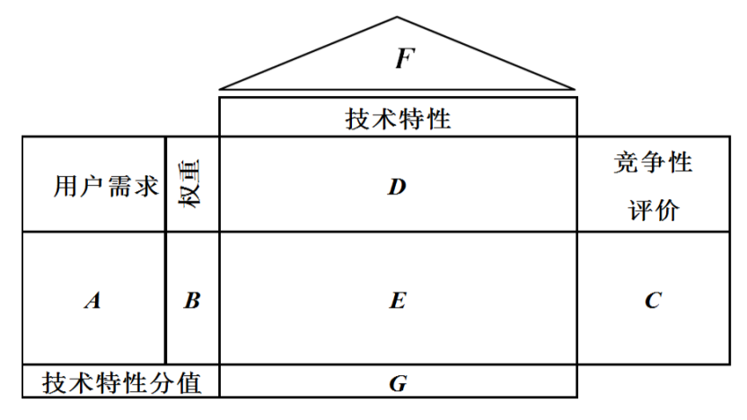

> [!example]+
> 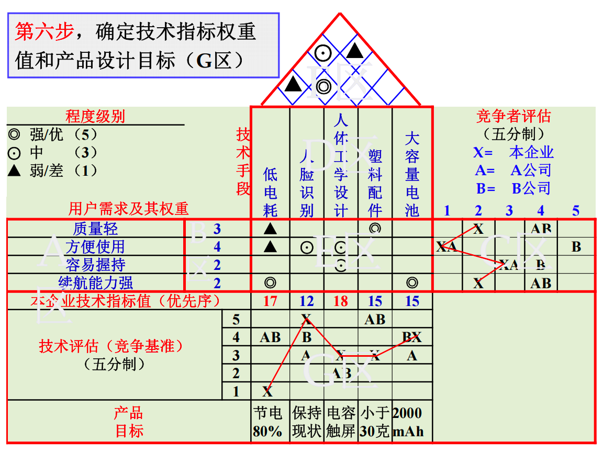

4. QFD 迭代：产品在不同开发阶段，关注的特性不同，而集成产品开发（IPD）强调在产品开发的不同阶段进行并行与交互。
	借助 QFD，可将产品特性在不同设计阶段展开质量功能展开，以“客户需求→产品技术需求→ 关键零件特性→关键工艺规划→质量控制参数”，形成迭代开发与交互过程
	

### 3 . 面向顾客的产品设计

1. *产品的顾客价值*：因使用产品而为顾客带来的利益。
2. <u>*价值分析和价值工程*</u>：分析产品是否融入了顾客所需要的“**价值**”，其目的是在**满足顾客需要**的前提下，**简化产品和业务过程**，从而以**较低的成本**获得**相同或更好的产品性能**。
	记忆方法：满足顾客需要，简化过程，成本降低，不改变或提高性能。
3. <u>价值工程</u>：**价值 = 功能 / 成本**

4. <u>顾客满意度模型</u>：**基本需求**、**期望需求**、**兴奋需求**。
	1. **基本需求**：是顾客认为在设计中必须满足的需求或功能。
	2. **期望需求**：是指顾客所希望的超出基本需求的某特殊需求。
	3. **兴奋需求**：此类需求一经满足，即使表现并不完善，也能到来客户满意度的急剧提高，比如出乎顾客预料之外的有用功能。
	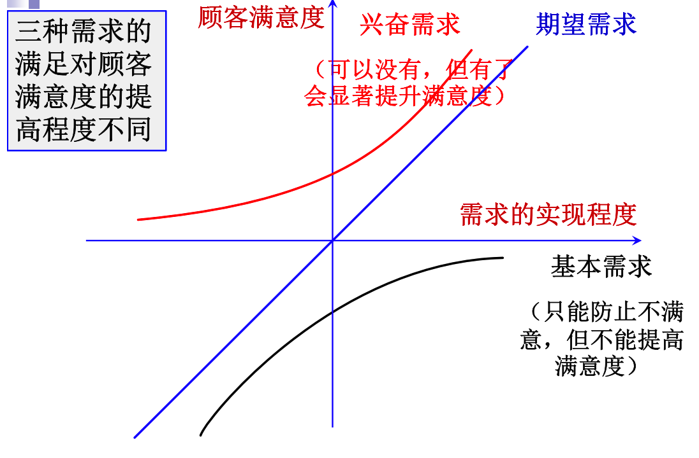
5. 产品设计要**面向顾客**、**面向制造与装配**、**面向环境**。
6. 面向制造与装配的产品设计
	1. 面向制造的产品设计  DFM：考虑产品可制造性
		方法：可使用材料、设计的简化和标准化、生产方法替换的灵活性、公差要求、专用设备和工装越少越好、供应链
		记忆方法：先看材料，然后看设计，再看生产（方法），再看误差，最后看设备和供应
	2. 面向装配的产品设计 DFA：简化产品设计、设计便于制造的零部件、零部件标准化通用化、模块化设计
		记忆方法：先看设计，再看零部件的可制造性，制造好了考虑通用化，能通用之后构建各种模块（模块化）。
	3. **零部件标准化和通用化**
	4. **模块化设计**：实现定制化关键是模块化
7. 面向环境的设计（DFE，知道有这么个东西就可以）

> [!example]+
> 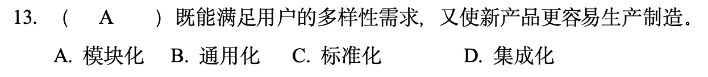
> 1. **A. 模块化**
> 把产品拆分成独立、可互换的标准模块。
> - 优势：更换、组合不同模块就能衍生多款产品，满足客户多样化定制需求；模块统一批量加工，降低生产难度，便于制造。完全匹配题干描述。
> 
> 2. **B. 通用化**
> 同一零部件可在多种不同产品上通用，侧重零件跨产品共用，不侧重快速组合出多样新品。
> 
> 3. **C. 标准化**
> 统一尺寸、规格、工艺、接口标准，侧重统一规范，核心是统一而非快速多样定制。
> 
> 4. **D. 集成化**
> 将多个功能整合为一体，结构高度整合，反而不利于衍生多款差异化产品。强调各阶段协同统一
> 
> 题干关键词：**多样性需求 + 易生产制造**，是模块化设计的核心特点。

## 9 . 生产系统流程、结构与战略

### 1 . 生产运作流程

#### 1.1 概述

1. *生产运作流程*：生产运作流程是运用**转换资源**把一定的**被转换资源**转化为一定**产品和服务**的一系列**逻辑**相关的**结构化**活动的集合。
2. **职能型组织**可以实现**较高的资源效率**，但因不同职能部门之间协调工作复杂，**流程效率较低**
	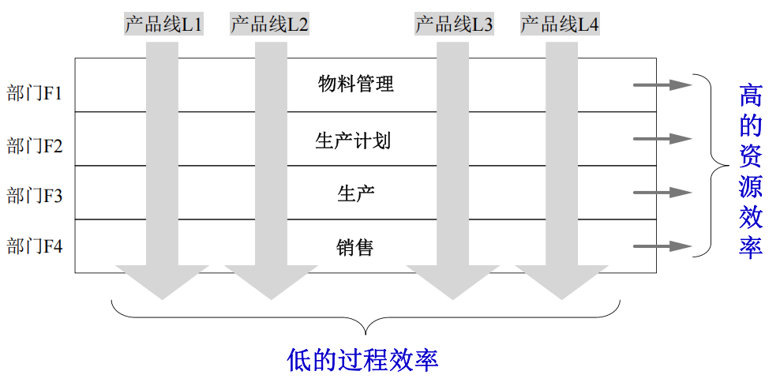
3. **流程型/聚焦型组织**
	1. 可以实现很**高的流程效率**；
	2. 如果生产和服务量不能使资源得到充分利用，则可能会带来**较低的资源效率**。
	3. 以内外客户作为过程的输出接受者，使过程的执行结果**及时得到客户检验**。
	4. 跨越职能部门边界，使割裂的业务过程集成，减少了不必要的部门间的**协调过程和扯皮**。
	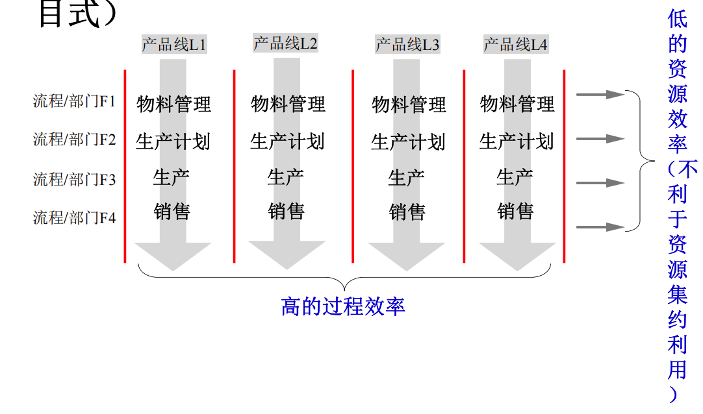
4. 资源效率：要求有效地利用企业资源，倾向于**职能化**，但是难以把握**企业总体流程目标**。
5. 流程效率：要求过程能很好地**实现业务目标**，但各职能部门需要协调，**资源使用效率**可能不高。
6. **复合型组织**中既有职能型结构也有流程型结构构；根据不同领域的特点追求不同的高效率，从而获得**整体效率的优化**。

#### 1.2 流程分析与评价

1. *流程图的三种形式*：**工艺流程图**、**流程程序图**、跨职能流程图。
	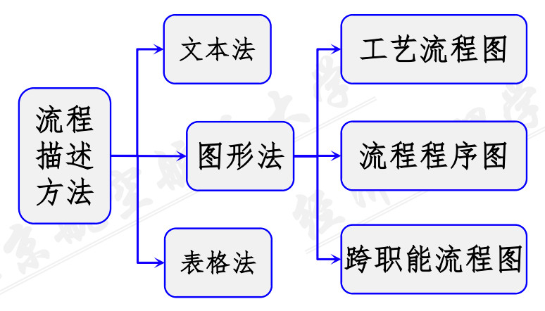
	1. 工艺流程图：只显示流程的基本业务活动/工艺处理步骤。
		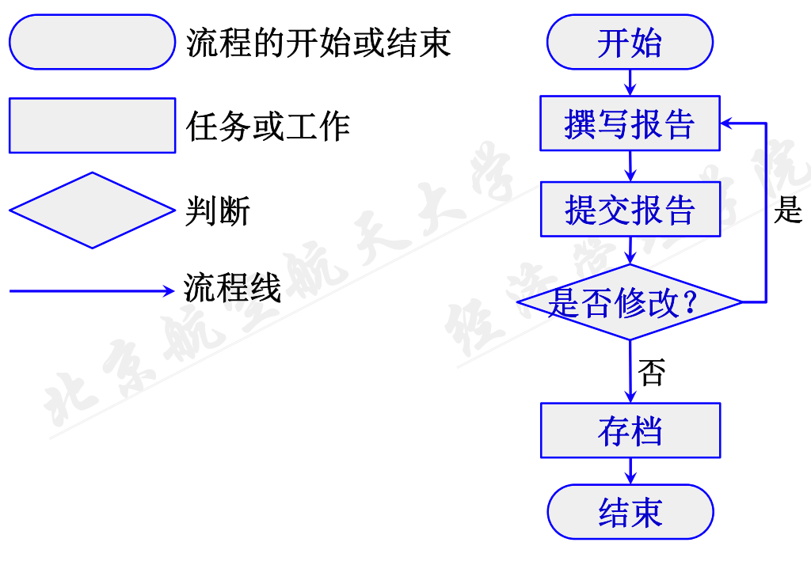
	2. 流程程序图：除了业务活动和工艺处理步骤，还加上搬运、等待、存储等元素。
		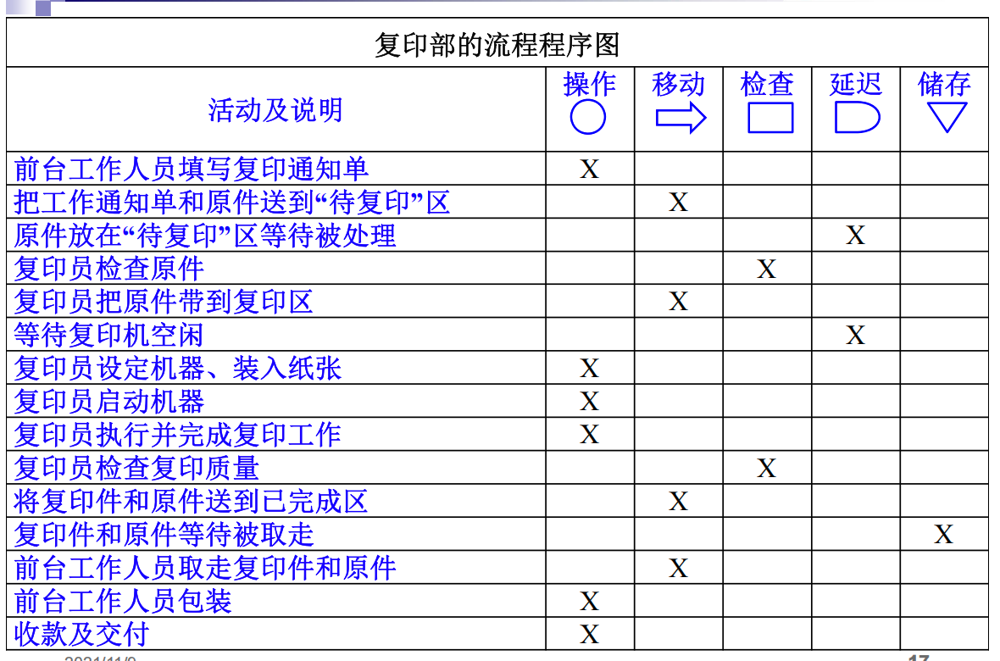
	3. 跨职能流程图：显示了各项活动的责任人、部门、以及流程上的相互协作关系。
		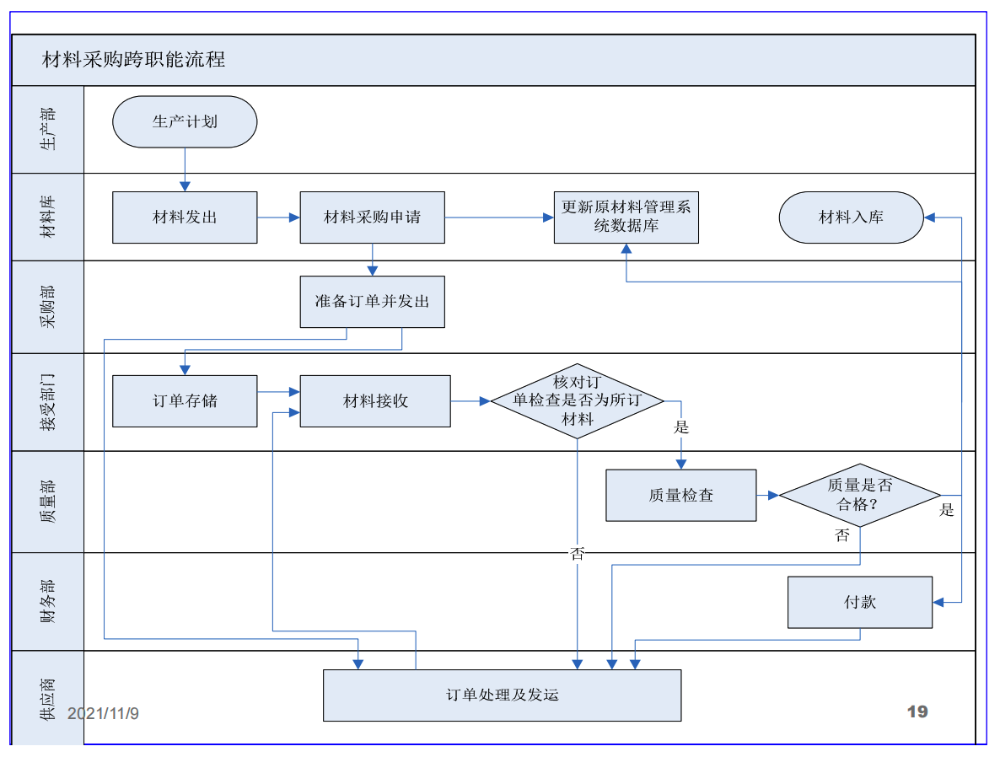

2. 流程周期效率（PCE）**= 增值活动时间 / 总流程时间**。
3. 流程再造
	1. **企业流程再造 BPR**：人们习以为常的企业流程多是根据早年的观念发展而成的，许多流程早已没有存在的价值，需要进行**彻底的、根本的重构与改造**
		但在实践中，企业流程再造给企业带来的冲击太大，在激烈竞争环境中，进行 BPR 的企业可能因承受不了变动而经营失败，因此有人提出不应该做彻底重构，应该进行持续改进——对所有流程做经常性的逐步改进，称为持续改进。
	2. **逐步改进**/**持续改进**：改进过程是一个连续的**戴明循环（Plan-Do-Check-Action, PDCA）**
	3. *业务流程再造*：对业务流程进行**根本性**的重新考虑和重新设计，从而显著的改进关键的绩效指标。（一般不会考虑流程再造而是采取小步骤流程改进）。

### 2 . 生产系统结构

1. 生产线布置：**工艺式布置**、**对象式布置**、**固定式布置**、**单元式布置**。
2. **工艺式布置**：搬运距离远，搬运量大；产品停放时间长，生产周期长；计划安排、制品管理、质量控制复杂。适用于每种产品产量比较低的生产系统。
	
3. **对象式布置**：产品批量不大时，难以充分利用生产设备和生产面积。
	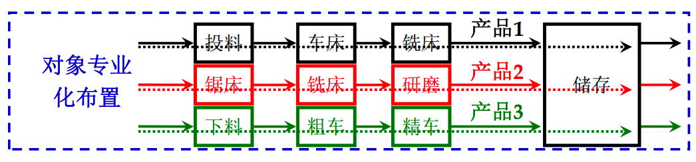
4. **固定式布置**：大型航空航天产品装配、大型轮船制造。
	
5. **单元式布置**：类似型号产品集中在一个制造单元里，每个单元能在一定范围灵活产出多种产品。多设备环形布置，投资更高，但保持一定柔性的前提下，能维持较高的产出
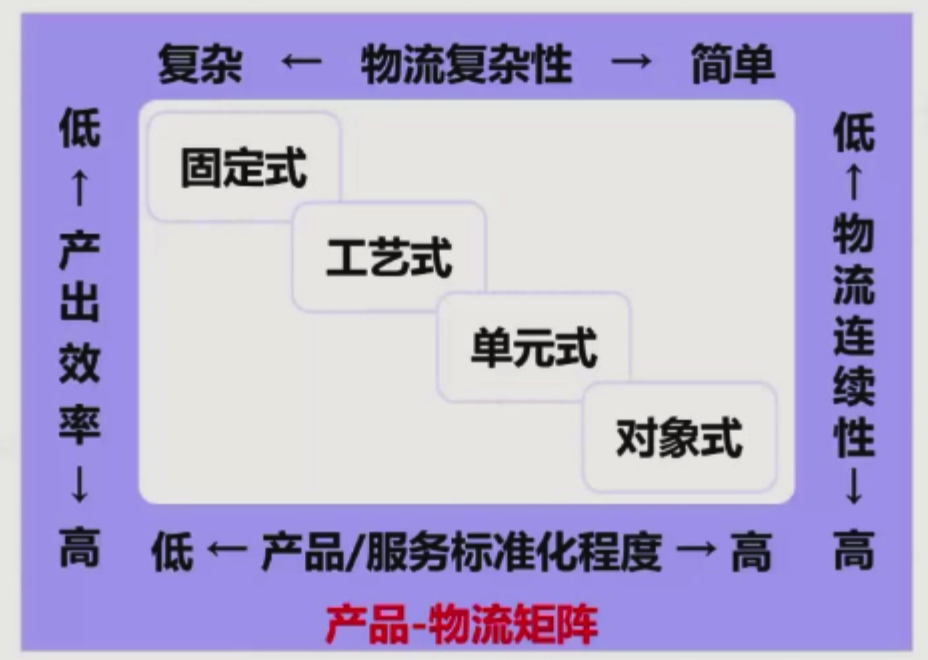

6. *制造系统集成*：**柔性制造系统**、**计算机集成制造**。
7. 柔性制造系统：在**相似零件组**的加工工序相同时，利用**传送带**或**梁性搬运装置**、工业机器人将**基本机器群**连结起来并保持一定柔性。
	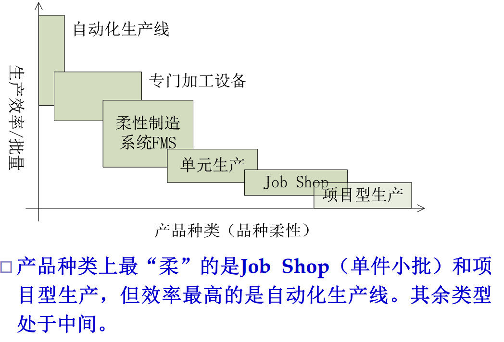
8. 计算机集成制造系统
	借助计算机软硬件，综合运用现代管理、制造、信息、自动化、系统工程技术，将企业生产全部过程中有关人、技术、管理三要素及其信息流与物流有机集成并优化运行，以实现产品高质、低耗、上市快，从而使企业赢得市场竞争

9. 生产管理方式：<mark style="background:#fff88f">这个考试会考</mark>
	1. **备货生产 / 推式生产**：根据需求预测，生产并储备产品库存，等待顾客购买
	2. **按单生产 / 拉式生产**：拿到顾客订单之后才根据订单需求开始生产
10. 客户定制分离点：**推 /拉过程的过渡点**
	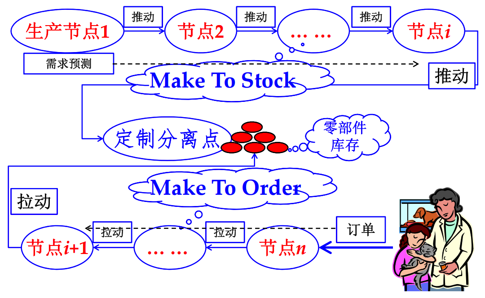
	分离点越靠上游，定制能力越强，反之越弱。

### 3 . 竞争优势与生产战略

#### 3.2 生产系统的战略性构造

1. 给例子问适合什么生产系统类型（批量流水型等，男装-女装）
	男装容易上市，因为男装更标准化批量化，衬衫西服等，而女装更个性化定制化
2. 生产系统类型：**项目型**、**单件小批型**、**批量流水型**、**大量流水型**（**人工节拍流水线**、**机器节拍流水线**）、**连续流程型**。
	
3. 生产系统结构‐功能关系悖论：没有哪种生产类型能同时在**物流连续性（效率）** 和**应变能力（柔性）** 两方面都达到最高水平。
	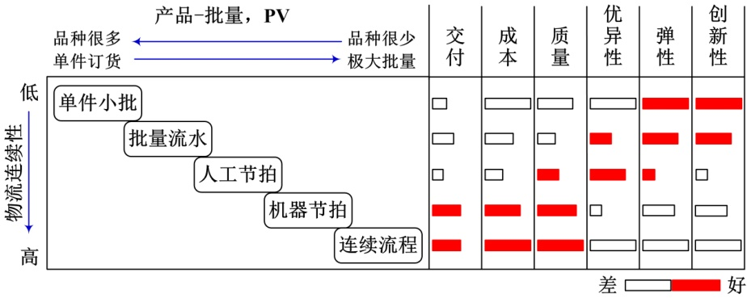

#### 3.3 世界级制造

1. CIMS 和 JIT 在一定程度上解决了“结构‐功能”悖论，被称为世界级制造系统
	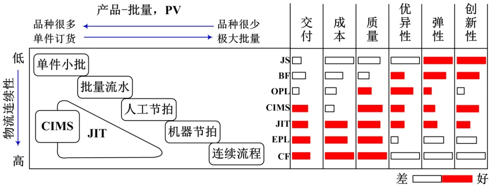
2. CIMS 计算机集成制造系统：以*信息技术、自动化技术、现代管理技术*为基础，把企业生产经营全过程（市场、设计、制造、管理、仓储、售后）所有孤立系统打通集成，实现信息流、物料流、资金流统一管控的一体化智能制造体系。
	核心思想：*全局集成，消除信息孤岛*。
3. JIT 准时化生产：起源丰田生产方式（TPS）的核心生产管理模式：*只在需要的时候，按需要的数量，生产需要的产品*，杜绝一切无效浪费。
	核心思想：*消除浪费、零库存、按需拉动生产*。
4. CIMS 和 JIT 的对比
	1. 成本方面：CIMS 成本多余 JIT
	2. 风险方面：CIMS 风险大于 JIT
	3. 创新能力：CIMS 强于 JIT
	4. 动态改善：JIT 优于 CIMS
5. 大规模定制：在**大量生产**的同时实现**多品种变化**，且能根据顾客需求进行**产品的模块化配置**，就实现了大规模定制（ mass customization ）生产
6. 个性化定制
	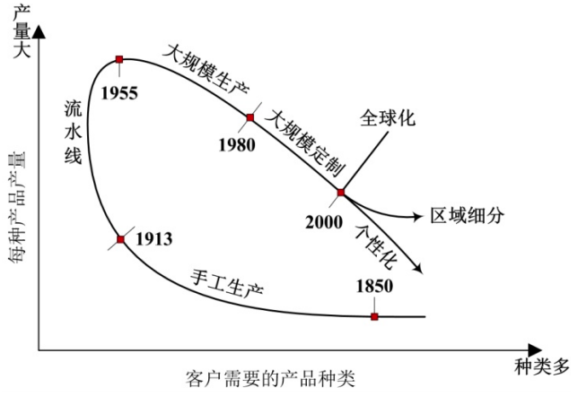

### 4. 绿色制造、绿色设计

### 5 . 全球战略 
微笑曲线
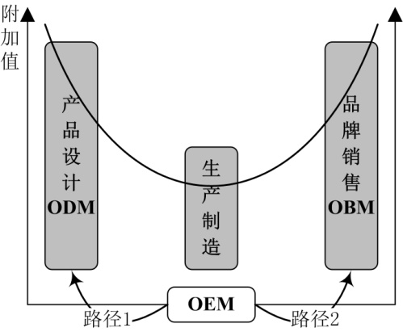

## 10 生产与供应链管理

### 1 . 库存管理

#### 1.1 需求预测
1. *需求变化的影响因素*：**趋势因素**、**季节性因素**、**周期性因素**、**随机因素**。
	记忆方法：春天到了，又到了动物们发情的季节（**季节**），这是一种趋势（**趋势**），且每年春天都会如此（**周期性**），发情的对象随机（**随机**）。
2. 需求预测方法：**主观预测法**、**客观预测法**（**时间序列预测法**（**移动平均法**、**指数平滑法**） 、 **因果预测模型**）
	记忆方法：先主观，后客观；客观从简单到难，时间顺序——平均数——指数——预测模型。
3. 【计算】移动平均法
> [!example]+
> 
> 
> 

4. 【计算】指数平滑法
> [!example]+
> 
> 
> 

#### 1.2 经济订货批量
1. *库存*：企业所持有的**原材料**、**零部件**、**产品**等用于生产或销售的物资。
2. 库存成本：**保存成本**、**订购成本**、**缺货惩罚成本**。

3. 【计算】经济订货批量（EOQ）
	假设：不允许缺货，不考虑订货提前期，产品入库瞬间完成。
	设单位时间的需求（率） 为 $D$ ，每件产品单位时间保存成本为 $C_h$（￥/单位产品.单位时间），每次订货成本为 $A$，若订货量为 $Q$ ，如何确定 $Q$ 的最优值？
	1. **单位时间库存总成本**： $C(Q) = \frac{A\times D}{Q}+\frac{C_{h}\times Q}{2}$
		单位时间发生的订货次数为： $\frac{D}{Q}$ ，所以单位时间总订货费用为：$\frac{A \times D}{Q}$ 。
		平均库存水平刚好就等于： $\frac{Q}{2}$，因此单位时间的总库存保存成本为： $\frac{C_{h}\times Q}{2}$。
		做 $C(Q)$ 关于 $Q$ 的求导
	2. **经济订货批量** $Q^{*}$：$Q^{*} = \sqrt{\frac{2AD}{C_{h}}}$
	3. **最低总库存成本** $C^{*}$：$C^{*} = \sqrt{2ADC_{h}}$

> [!example]+
> 
> 

> [!example]+
> 

### 2. 批量问题与生产计划

1. 单投入单产出：生产率；多投入多产出：效率
2. 经济生产批量（EPQ）：$EPQ = \sqrt{\frac{2DA}{C_{h}}}\sqrt{\frac{p}{p-d}}$
	
	
3. 经济生产批量：启动一次生产，就发生一次**生产准备成本**，而持有库存又要支付**保存成本**，因此类似有一个最佳生产量
4. 生产计划体系结构：**综合生产计划**、**主生产计划**、**物料需求计划**、**车间调度计划**、**生产计划滚动**。

### 3. MRP 和 JIT 系统

#### 3.1 MRP——推式生产方式

1. MRP 物料需求计划：将**预测的需求**通过**产品物料清单（BOM）** 分解为原材料、零部件的生产或采购计划，并下达给各生产单位启动生产
	1. 到了 MRP 这一层，生产计划才能开始执行。
	2. MRP 基本思路：从成品主生产计划开始，**逆工艺路线**，从成品向下逐层分解，直到得到各零部件以及外购原材料的生产和采购计划。
2. MRPII：IBM 公司在 MRP 的基础上，增加了**财务会计管理职能**，实现了生产、库存、采购、销售、财务和成本子系统的信息集成
3. 产品物料清单（BOM）：以树状分层结构将产品分解为部件、零件直至原材料。
	
	考试会考（下面这张图中内容）
	
4. MRP 适合 BOM 结构较为复杂，但*需求和生产不确定因素较低*的离散制造装配型生产环境

#### 3.2 JIT——准时制生产（拉式生产方式）

1. 准时制生产（JIT）：就是要求产品线各环节将**必要的产品**（ 原材料、零部件或成品），以**必要的数量**和**完美的质量**，在**正确的时间**送往**正确的地点**。
2. *JIT 定义了七大浪费*：过量生产、等待、搬运、无效的流程、库存、冗余 / 无效的动作、次品和缺陷。

3. JIT 的生产是等顾客需求到达才开始，因此是**需求拉动**的生产方式（和**计划推动**的持有库存生产方式相对）
4. JIT 基于**实际需求信息**进行计划分解，而 MRP 是根据**需求预测**进行计划分解

5. 两种看板：**搬运看板**、**生产看板**。
6. 看板系统的核心原则是：“**看板为王**”，**无看板，不搬运**；**无看板，不生产**。

7. 【计算】看板数量。
	
	

> [!example]+
> 

### 4. 供应链管理

#### 4.1 供应链管理的基本概念

##### 4.1.1 什么是供应链管理

1. *供应链*：多个企业以**供应-需求**关系为基础，组成了**链状或者网状**的**多实体**结构
2. *供应链管理*：企业为获得竞争优势，对供应链中的**物料流**、**信息流**、**资金流**、**工作流**、**贸易伙伴关系**等进行的**计划、组织、协调、控制**的一体化管理。
3. 供应链管理策略
	1. **纵向一体化**：**扩大规模**，“**大而全**”的企业经营模式
	2. **横向一体化**：**重点做好自己擅长的业务**，通过与其他企业密切合作，整合供应链上的资源而获得成功。
4. 供应链角色：**供应商**、**制造商**、**分销商**、**零售商**、**顾客**。

##### 4.1.2 供应链决策

1. *供应链决策*：在供应链的不同层级上，制定**物料流**、**信息流**、**资金流**、**工作流**以及**贸易伙伴关系**等的运作与管理策略
2. 供应链决策分层：**战略层**、**战术层**、**运作层**
	
	记忆方法：先确定战略，再细化到规划，然后开始运行。

##### 4.1.3 供应链的流程

1. *供应链由一系列流程组成*，这就是**工作流**；工作流是*资金流*、*信息流*、*物流*的逻辑支撑。
2. 有两类工作流：
	1. 相邻环节之间的**业务循环流**：由供应链的一系列具体业务运作过程构成；
	2. 整条供应链的**产品增值流**：由供应链的推动流程和拉动流程结合而成
3. **业务循环流**：**采购循环**、**制造循环**、**补货循环**、**顾客订单循环**。
	
	记忆方法：制造商向供应商采购、分销商向制造商提出制造要求、零售商要求分销商补货、顾客给零售商下订单。
4. **产品增值流**：**原材料**——**零部件**——**成品**——**分销**——**零售**——**顾客**。
	1. 增值链前半部分：“原材料→零部件→成品” 是通过不断注入**有形的物质和付出劳动**而使产品价值不断增长
	2. 增值链后半部分：“分销→零售→顾客” 提高**便利性**&**注入劳动来提高产品满足需求的能力**（分拣包装等），此外也增值了
	3. 所谓增值，指的就是增加了顾客价值。
5. 供应链是**推/拉过程**的结合
	1. 推动流程和拉动流程分界于**推/拉结合点**
6. 例：
	1. 中低档家具供应链：个性化定制少，需求变化不大，其推/拉分界点接近销售终端甚至是备货型生产
	2. 高档家具供应链：根据客户需求进行个性化定制制造，需求变化大，推/拉分界点就定在家具制造商

#### 4.2 供应链战略构造

1. *供应链战略匹配*：以合适的供应链战略结构应对具有一定需求特性的产品。重点在于其**需求的不确定性**。
2. 不确定性越大，则要求供应链的**响应性**越强
3. **响应性**和**生产效率**一般是互悖的：高响应——低效率，高效率——低相应。
	
4. 打破响应性-生产效率悖论：世界级制造系统

#### 4.3 供应链的运作与管理

1. *供应链运作*：**计划**——**采购**——**制造**——**交付**。
	记忆方法：先制定计划，然后去买东西（采购），有了原料开始制造，造出成品开始交付。
2. *物流管理*：**物流与供应链**、**第三方物流**、**第四方物流**。
3. *第三方物流*：由产品提供方与需求方以外的**专业物流企业**负责产品运输的物流管理模式。
4. 供应链失调：*供需不同步*。
5. 牛鞭效应：
	1. 定义：客户需求的微小波动，会引起**上游制造商、供应商**等所获**信息**的**剧烈变化**。
		记忆方法：握住一条绳子的一端轻轻抖动，另一端会剧烈摆动。
		
	2. 原因：**信息加工**、**配给和短缺博弈**、**大批量效应**、**价格恐惧**、**其他原因**。
		记忆方法：先看信息传递有没有问题（是不是不同步），然后看供给（分为短缺和大批量两种过分情况）、之后看价格，最后有其他原因。

## 11 质量管理

### 1 质量管理概述

1. 质量：**一组固有特性满足要求的程度**。
2. 质量的好坏由**产品或服务的接受者**来评判
3. 现代质量管理发展阶段：**质量检验（泰勒）**——**统计质量管理（休哈特）**——**全面质量管理（费根堡姆）**——**标准化质量管理**
	记忆方法：看结果检验——用统计方法来管理——趋于全面——趋于标准化。
	1. 质量检验阶段：由美国的泰勒提出。
		在生产出产品之后，进行*事后检验*，但在生产过程中*没有进行过程控制*。
		事后检验通常是*全数检验*，花费较高，*不适用于破坏性检验*（如汽车安全气囊质量检验）的情况，也无法进行事前预防。
	2. 统计质量管理阶段
		1924 年，贝尔实验室休哈特的“过程控制研究组”提出了“*事先控制和预防*”，建立了生产过程控制图；
		1929 年，休哈特的同事道奇和罗米格的“产品控制研究组”，提出了*抽样检验*（sampling）方法。
		1920——1940 年代进入了统计质量管理阶段：运用统计推断原理，实现生产过程的*事先控制*，用*抽样*方法弥补了质量检验阶段各种方法的不足。
	3. 全面质量管理阶段
		19 世纪 60 年代由通用电气（GE）的阿曼德·费根堡姆（1922-2014）提出，是目前最主流的方法。
		全面质量管理将质量控制，从原来的生产系统扩展到*产品寿命周期的全过程*，同时强调*全体员工、全体部门*参与质量控制。
		更适应现代多样化生产对质量管理的要求，使质量管理从局部走向了全面系统的阶段。
	4. 标准化质量管理阶段
		由于生产规模及生产模式的多样性，所生产的同一系列的产品也出现了质量标准的不同，促使许多企业研究*质量管理行业内的统一问题*，因此制定了各种*质量管理标准*。
		通过 *ISO* 认证是现代企业的普遍做法。
4. 质量管理大师
	1. 戴明：“**十四要点**”、**戴明环**。
		戴明环：PDCA 是一个质量持续改进模型，包括持续改进与不断学习的四个循环反复的步骤：**计划(Plan)**、**执行(Do)**、 **检查(Check)**、**处理(Action)**。
	2. 朱兰：**朱兰三部曲**、**质量螺旋曲线**。
		**朱兰三部曲**：**质量计划**、**质量控制**、**质量改进**。
		记忆方法：运作之前要计划，运作之中要控制，运作之后要改进。
	3. 克劳斯比：“零缺陷之父“、零缺陷质量管理。
	4. **费根堡姆**：**全面质量管理**（TQM）。
		全面质量管理：企业中所有部门、所有组织、所有人员都以产品质量为核心，控制全部业务过程中影响质量的因素。
	5. 石川馨：**鱼骨图 / 因果图 / 鱼刺图**。

### 2 质量管理工具

1. 质量管理工具：调查表、分层法、排列图、因果图、直方图、散布图、控制图。
2. 调查表：
	1. 缺陷位置调查表
		
	2. 不良品检查表
		
	3. 质量分布调查表
		
3. 分层法
	
	
4. 排列图又称帕累托图。
	
5. 因果图
	
	 
6. 直方图 **判断类型**
	
	**标准：正常直方图** **陡壁：尺寸偏离** **双峰：数据多个来源**
	**孤岛：出现异常** **平顶：可能刀具变钝** **锯齿：数据分组不当**
	
7. 散布图/相关图 **判断**
	**强正相关** **强负相关**
	**弱正相关** **弱负相关**
	**不相关** **非线性相关**
	
8. 控制图
	
	1. ±3σ原理：任意抽取一个样品 X，如果处于**正常控制**的生产状态中，则可以认为**X 的特性值（如均值）大概率分布在 μ±3σ 之内（μ为期望值， σ为方差）**，而出现在该范围之外是不可能的或小概率事件。
	2. 上下控制线不一定刚好 3σ线。
	3. 判稳准则：控制图上的点没有越出控制界限，且点的排列无缺陷
		即同时满足
		1. 连续 25 个点都在控制限内；
		2. 连续 35 个点，至多 1 个点落在控制限外；
		3. 连续 100 个点，至多 2 个点落在控制限外。
	4. **判异准则**：PPT 上的八个异常情况发生其一，则证明存在异常
		
	5. 两类错误：和概统中的假设检验两类错误有点像，第一类错误为**α错误**，本来是真的结果误认为假的虚发警报，**弃真**；第二类错误为**β错误**，本来是假的结果误认为真的，漏发警报，**纳伪**。

### 3 质量成本

1. 质量成本：**质量运行成本**（**鉴定成本**、**预防成本**）、**质量故障成本**（**内部损失成本**、**外部损失成本**）
	
	
2. 六西格玛管理
	1. 来自摩托罗拉公司
	2. 假设设计公差范围为 ±T，如果随机数的 ±3σ在±T 内，不考虑公差中心偏移，那么产品合格率会达到 99.73%。
	   若±6σ 在±T 内，则当公差中心无偏移时，产品合格率接近于 1（对应缺陷率为 5 亿分之 1）
	3. 管理的流程包括：（**DMAIC**）**定义(Define)**、**测量(Measure)**、**分析 (Analyze)**、 **改进(Improve)**、**控制(Control)**。

## 12 项目管理

### 1 *现代项目管理简介*

1. 项目：项目是为获得独特产品、服务或成果而实施的临时性工作。**临时性**，**独特性**。

2. 项目管理：项目管理是指采用**计划**、**组织**、**领导**和**控制**等管理手段确保项目成功，是确保实现从项目资源输入到项目产出的管理过程。
	记忆方法：用管理的职能（四大职能）来让资源变成项目的过程。

3. 项目管理技术：**工作分解结构 WBS**、**责任分配矩阵 RAM**、**关键路径法 CPM**、**计划评审技术 PERT**、**挣值分析 EVA**。
4. 项目生命周期：**启动**、**规划**、**实施**、**收尾**。

### 2 *工作分解结构 WBS 和责任分配矩阵 RAM*

1. 工作分解结构：WBS（ work breakdown structure ）用于界定项目工作范围，它是以**可交付物**为导向的**工作层级分解**，所分解的对象是项目团队为实现项目目标、提交所需可交付成果而实施的工作，其最低层次称为工作包。
	记忆方法：以可交付物（就是可以给人看的东西）为导向，分解工作。
	
2. WBS 分解的原则
	1. WBS 应包括全部工作
	2. WBS 分解程度根据项目自身而定
	3. WBS 的工作包应有明确的交付物、工作内容、责任主体、预算要求等
	4. WBS 应设置不同层级的单元，对应唯一编码（类似哈夫曼树？）
	5. WBS 应附加工作说明书，对可交付物做详细说明。

3. 责任分配矩阵（RAM）：将工作分解结构与干系人联系起来。
4. 责任分配矩阵的 RACI 图
	1. R（Responsible）——工作由谁执行
	2. A（Accountable）——由谁签字负责
	3. C（Consulted）——可以向谁咨询
	4. I（Informed）——应该通知给谁
	

### 3 项目网络与关键路径 CPM

#### 3.1 概念

1. 通过网络图计算各活动的开始、结束等时间参数，可识别其中的关键活动，关键活动组成关键径路，该关键路径决定了**项目周期/总工期** 。
2. 通过关键路径确定项目周期的方法称为**关键路径法 CPM**

3. 单代号网络图 AON（activity on node）：活动在点上
	
4. 双代号网络图 AOA（activity on arrow）：互动在边上
	
5. 紧前活动、紧后活动:如果活动 j 必须在活动 i 完成之后才能开始，则称 i 为 j 的紧前活动（简称前活动）；反过来， j 为 i 的紧后活动（简称后活动）

#### 3.2 计算 <mark style="background:#fff88f">考试会考</mark>

1. 7 个时间参数
	1. 工作持续时间 DU
	2. 最早开始时间 ES
	3. 最早完成时间 EF
	4. 最晚开始时间 LS
	5. 最晚完成时间 LF
	6. 总浮动时间 TF
		在不延误项目总工期或违反进度制约因素的前提下，某工作可以推迟的总时间量，**TF = LS – ES = LF - EF**
	7. 自由浮动时间 FF
		在*不延误其紧后工作*最早开始日期的前提下，某工作可以推迟的时间量，**FF = min(ES_j) - EF_i**

##### 计算步骤
1. 绘制网络图
	
	
2. 正推计算最早时间 ES EF
3. 逆推计算最晚时间 LS LF
4. 计算总时差和自由时差 TF FF
5. 确定关键路径
	1. *总时差为 0 的活动*不能自由浮动，必须保证进度，否则会影响总工期，因此称为*关键活动*。
	2. 总时差为 0 的活动（关键活动）构成的从项目开始节点到终止节点的路径称为*关键路径*。
	3. 关键路径是网络图中时间最长的路径，决定了项目工期；且关键路径不一定唯一。

> [!example]+ 画网络图&求关键路径
> 
> 
> 

> [!example]+ 绘制网络图并确定网络图的时间参数
> 
> 
> 
> 
> 
> 
> 
> 

### 2 挣值分析 EVA

1. 挣值分析需要获取三种不同的费用值：**计划价值 PV**、**挣值 EV**、**实际成本 AC**。

#### 2.1 基本成本指标

1. **完工预算 BAC (budget cost at completion)**：预计完工要花多少钱。在计划阶段对项目进行成本估计，反映了项目/工作的计划价值。
2. **计划价值/计划值 PV (planned value)**:当前理论应该花了多少钱。指在某检查点，按计划应完成的工作所对应的预算成本。
3. **实际成本 AC (actual cost)**：当前实际花了多少钱。指已完成的工作消耗的实际费用。
4. **挣得值 EV (earned value)**：当前实际工作量理论应该花了多少钱。指经过验收且符合质量要求的工作，基于实际完成的比例，按照预算标准折算之后的价值。
	

#### 2.2 挣得分析的绩效指标

1. **成本偏差**（Cost Variance，CV）：衡量项目**成本绩效**。**CV = EV−AC**。
2. **成本绩效指数**（Cost Performance Index，CPI）：衡量项目**成本效率**。**CPI = EV／AC**。
	代表了成本节省程度，越大代表节省的越多；若 CV<0 或 CPI<1，代表成本超支。

3. **进度偏差**（Schedule Variance，SV）：衡量项目**进度绩效**。**SV = EV – PV**。
4. **进度绩效指数**（Schedule Performance Index，SPI）：衡量项目**进度效率**。**SPI = EV／PV**。
	代表了进度超前程度，越大代表超前的越多；若 SV<0 或 SPI<1，代表进度延迟。

#### 2.3 完工预算 EAC

1. 完工估算（Estimate at Completion，EAC）就是项目进行到一定程度时**对总成本的估计**
	1. 剩余预算根据当前执行情况外推得到
		EAC = 实际支出 ＋ 参照目前情况对剩余预算的估计
	2. 剩余工作的预算完全重新估计
		EAC = 实际支出 ＋ 对未来剩余工作的重新估算
	3. 剩余预算不变
		EAC = 实际支出 ＋ 剩余的原预算

> [!example]+
> 
> 
> 
> 
> 
> 
> 

## 13 投资项目经济评价

画净现金流量图、求净现金流量、折旧、项目可行

1. 投资项目的两个阶段：**投资建设阶段**、**项目运营阶段**
	记忆方法：**先投资，后运营。**
2. 项目经济评价：**项目的技术可行性**、**总收益是否能补偿全部投资支出**

### 1 投资与收益

#### 1.1 建设期投资

1. 投资形成的资产：**固定资产**、**无形资产**、**递延资产**、**流动资产**。
2. **固定资产**：固定资产是指通过投入资本所形成的，使用期限较长，单位价值较高，能在使用过程中保持原有物质形态，**并能为多个生产周期服务的资产**。
	e.g.投资建设的厂房、购买的机器等
3. 固定资产在生产经营过程中因逐渐损耗而价值减少；所减少的价值转移到**产品**中形成了**产品价值**的一部分。 具体核算时，固定资产损耗以**折旧**的形式计入产品成本。
	记忆方法：固定资产就是生存时间较长的资产；一切为产品服务，固定资产减少的价值跑到了产品里；固定资产的损耗叫做折旧，下面会提到。
4. **无形资产**：长期使用，以“无形资产摊销”作为“管理费用”计入成本，通过收益补偿回来。
5. **递延资产**：管理费用，统称为开办费。多个生产周期，形成“递延资产摊销”，做为管理费用计入成本。
6. **流动资产**
	1. 为单个营业周期准备的资金/资产。每个经营周期用于生产支出，但通过销售收入再回收，进出差价产生利润。
	2. 在一个生产周期中**一次性**被消耗，其价值**一次性**转移到产品成本中。

#### 1.3 收益

1. 收益
	1. 利润 = **销售收入 – 总成本**
	2. 销售收入 = **销售量×单价**
	3. 总成本 = **生产成本 + 期间费用**
	
2. 生产成本：**直接成本**（变动成本） + **制造费用**
	1. **直接成本**：直接消耗原料燃料，支付工资等。
	2. **制造费用**
		1. 折旧：**固定资产**由于**磨损或陈旧因素**价值降低。
			1. 折旧的方法：直线折旧法（常用）、加速折旧法、工作量折旧法。
			2. **账面价值**：固定资产原值减去已经计提的折旧费，称为固定资产账面价值。
			3. **残值**：在项目运行寿命期末的剩余账面价值
		2. 其他制造费用：车间管理人员的工资、设备的日常维护费等
3. 期间费用：非直接生产部门的费用
	1. **管理费用**：公司高层办公费、工资、**递延资产**和**无形资产**摊销等；
	2. **财务费用**：贷款利息、汇兑损失等；
	3. **销售费用**：市场销售发生的费用，如广告、促销活动等。
	记忆方法：销售部门的财务管理

#### 1.4 现金流

1. 现金流量是指项目/工程技术方案在寿命期内各支付周期（年）收入和支出的**货币量**。
2. 净现金流量：某支付周期的收入和支出的**代数和**。
3. 经营成本 **= 总成本 – 折旧 – 资产类摊销**
4. 净现金流 = **利润 + 折旧 + 资产类摊销**。
5. 净现金流 = **销售收入 – 经营成本**
6. 现金流量图（重要！！！）
	1. 支出项目：**年初**，**下箭头**
	2. 收益项目：**年末**，**上箭头**
	注：这里的年初年末是对于一年来说的，通常支出在一年的年初发生，而收益在一年的年末发生。

> [!example]+
> 
> 

### 2 资金的时间价值

#### 2.1 资金价值
1. 资金的时间价值：资金在周转使用过程中随着时间因素而形成的**价值差额**（资金随时间增长而值钱，一般都是值钱了）
2. 资金等值：由于资金的价值随着时间会发生变化，因此在**不同时间点**上，**不同额度的资金**可能**价值相等**。
3. 折现：衡量不同时间点上资金的价值，可以将其**等价换算到现在的时间点**上，这称为折现。
4. 现值：**未来时点上的资金折现到现在时点的等额资金价值**，称为现在值/现值（present value）。
5. 将来值：**与现在值等价的未来某时间点上的资金价值**称为将来值（future value）。

6. 利息
	1. 计息周期：计算利息的时间单位
		对于复利来说，计息周期越短，则同样利率下经过同样时间，得到的利息越多
	2. 单利：只计本金利息，利息本身不再作为计息的基础、
		
		
	3. 复利：除本金以外，利息也作为计算下个计息期利息的基础，即“利滚利”
		
		

#### 2.2 资金的等值计算（复利条件下）

1. 【计算】资金的等值换算。
	P — 现值 F — 将来值
	i — 年利率 n — 计息期数
	A— 年金/年值：每个计息期末等额发生的现金流量
	1. F-P 一次支付终值公式
		
	2. P-F 一次支付现值公式
		
	3. F-A
		
		
	4. A-F
		
	5. A-P
		
		
	6. P-A
		
2. 名义利率 r：**银行 / 合同标明的年利率**，不考虑年内多次复利计息，只是表面标注利率
3. 实际利率 i：**考虑一年内部多次利滚利后，真实等效的全年收益率**，反映资金真实增值水平
	$i = (1 + \frac{r}{m})^{m}-1$，m 是一年内计息次数

### 3 经济可行性分析

#### 3.1 投资回收期

1. 静态投资回收期：不考虑**资金时间价值**，在项目投产后，以每年取得的净收益，将全部投资回收所需的时间。即**累积净现金流为 0** 的 n 值

> [!example]+
> 
> 
2. 当项目的投资回收期 n 小于/短于基准投资回收期 n0，即：**n ≤ n0 时，就认为项目是可行的**。

3. 动态投资回收期：将各时间点上的净现金流统一折现之后再计算投资回收期。即满足下式的 nd，其中 i0 为行业基准贴现率
	$\sum\limits^{n_{d}}_{t=0} F_{t}(1+i_{0})^{-t} = 0$

> [!example]+
>  

#### 3.2 净现值法

1. 净现值（net present value，NPV）：不同时间上发生的净现金流量，通过某个**规定的利率** $i_0$ 统一折算为第 0 年的**现在值，然后求代数和**。
2. 规定的利率 i0 称为**基准贴现率/基准折现率**
3. $NPV(i) = \sum\limits^{n}_{t=0}F_{t}(1+i_{0})^{-t}$
	$F_{t}$ ——第 t 年末净现金流量
	$n$ ——项目寿命期
	$i_0$ ——基准折现率
4. 以净现值法判断项目可行的标准是 $NPV (i_0) ≥ 0$

> [!example]+
> 
> 

#### 3.3 内部收益率法

1. 使 NPV 恰好等于 0 的折现率就称为**内部收益率**(IRR)
	即 $NPV(IRR) = \sum\limits^{n}_{t=0}F_{t}(1+IRR)^{-t} = 0$

> [!example]+
> 
> 

2. 判据：**IRR > i0，则项目可行**（i0 为基准贴现率）
3. 当 $i_{0}<IRR$，项目有收益；若 $i_{0}$ 刚好等于 $IRR$，收益刚好为 0。
4. 用内插法求解
	$NPV(i)$ 是 $i$ 的减函数，取折现率 $i_1$ 和 $i_2$，满足：$|i_{1}–i_{2}| ≤ 0.05$ (5%) ，且 $NPV(i_{1}) × NPV(i_{2}) < 0$，
	
	

> [!example]+
> 
> 

### 4 项目方案的经济比较

#### 4.1 寿命期相同方案的比较

1. 两个方案的现金流量之差的净现值称为**投资增额净现值**
2. 法 1：将两个方案的现金流之差作为**虚拟项目**，判断虚拟项目的可行性。
	
	

> [!example]+
> 
> 
> 
> 

2. 法 2：直接比较各自 NPV，NPV 大的更好。

#### 4.2 寿命期不同方案的比较

1. **最小公倍数法**：或称重复法，是以两个方案服务寿命的最小公倍数作为共同期限，并假定这两个方案在这个期限内可以**重复实施若干次**。
	实质上就是把寿命期不同的项目转化为寿命期相同的项目。

> [!example]+
> 
> 
> 
> 

#### 4.3 非常规投资项目

1. **常规投资项目**
	1. 净现金流从负变正只一次
	2. 全部净现金流量代数和为正
2. **非常规投资项目**：只有投入没有收益、或只有收益没有投入、或现金流多次变号、或者净现金流代数和小于 0 等项目，统称为非常规（投资）项目
	
	

