我国核算年度 GDP 采用的方法为 **支出法**
 #cloze 

## 1 . 经济学原理

1. 微观经济学研究的基本问题：**生产什么和生产多少**、**如何生产**、**为谁生产**。**资源配置**
2. 宏观经济学所考察的基本问题：**一个社会既定的生产资源总量是否得到充分利用**、**如何得以充分利用**。**资源充分利用**
3. 微观经济学要以**单个经济单位（单个消费者、单个生产者、单个市场经济活动）** 作为研究对象；<u>宏观经济学</u>以**国民经济总过程的活动**为研究对象。
4. 经济学发展历史（微观经济学、宏观经济学基础）
	1. <u>现代经济学说的发展</u>：**启蒙阶段**、**古典学派**、**新古典主义**、**马克思主义和社会主义**、**凯恩斯主义**、**后凯恩斯时代**。
	2. 古典经济学
		1. **亚当·斯密**：《**国富论**》标志着**古典经济学**的诞生，**自由竞争**是古典经济学派的不二信条。奠定**微观经济学**基础
			学说内容：劳动和分工（流水线）、价值价格、经济人和看不见的手
		2. 大卫李嘉图：劳动价值学说
	3. <u>新古典主义</u>
		1. **马歇尔**：新古典经济学的奠基者。
	4. 凯恩斯主义
		1. **凯恩斯**：奠定**宏观经济学**基础。国家干预

## 2 . 微观市场机制分析

1. 生产者的演进：**工场手工业**、**工厂制**、**现代企业**
2. <u>根据需求的收入弹性/需求的价格弹性需求定律对商品进行分类</u>
	
	1. 商品需求量与收入呈反方向变化。
		1. 价格弹性为正，价格⬆️需求量⬆️：吉芬品
		2. 价格弹性为负，价格⬆️需求量⬇️：一般低档品
	2. 商品需求量与收入呈同方向变化
		1. 收入弹性<1，必需品
		2. 收入弹性>1，奢侈品

3. 薄利多销（**需求的价格弹性大**）、谷贱伤农（**需求大价格弹性小**）
4. 需求价格弹性的分类
	1. **完全弹性**：弹性为无穷大。 
	2. **富有弹性**：弹性大于 1。
	3. **单位弹性**：弹性等于 1（需求曲线为双曲线）。 
	4. **缺乏弹性**：弹性小于 1。 
	5. **完全无弹性**：弹性为 0。
	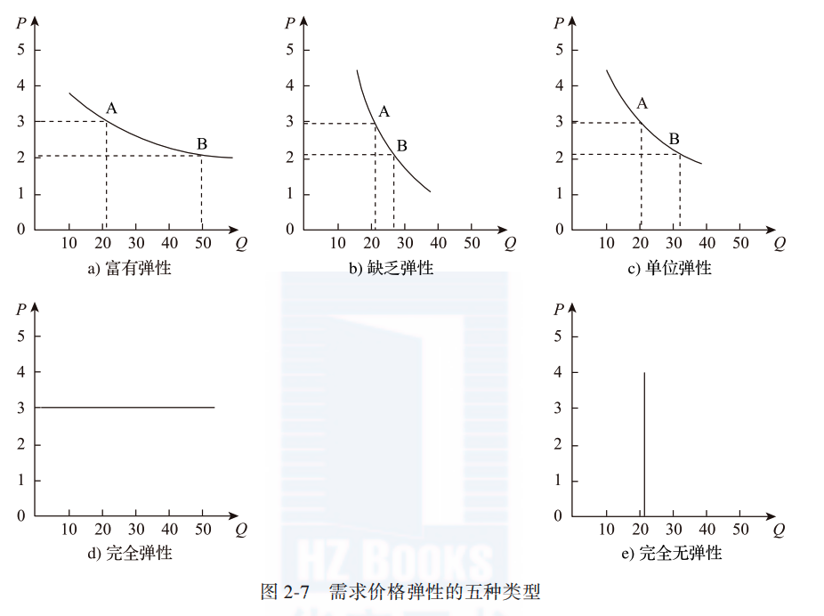

5. 交叉价格弹性与商品关系（替代/互补）
	1. **互为替代品，则交叉价格弹性为正；**（苹果&梨）
	2. **互为互补品，则交叉价格弹性为负；**（汽车&汽油）
	3. **无关，交叉价格弹性为 0.**（食盐&蔗糖）

6. 供给的价格弹性的分类
	1. **完全无弹性**：弹性为 0。a
	2. **缺乏弹性**：弹性小于 1。b
	3. **单位弹性**：弹性等于 1。c
	4. **富有弹性**：弹性大于 1。d
	5. **完全弹性**：弹性为无穷大。e
	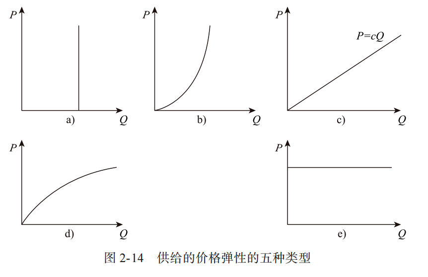

7. 价格补贴和税收
	1. 只对生产者征税，**使生产成本提高，供给曲线左移，需求曲线不变，导致均衡价格上升，均衡数量减少**；
	2. 只对生产者补贴，**使生产成本降低，供给曲线右移，需求曲线不变，导致均衡价格下降，均衡数量增加**；
	3. 只对消费者征税，**使收入水平降低，需求曲线左移，供给曲线不变，导致均衡价格和数量都减少**；
	4. 只对消费者补贴，**使收入水平提高，需求曲线右移，供给曲线不变，导致均衡价格和数量都增加**。
	
	
8. 税收 / 补贴都由**斜率大（价格弹性小）** 的一方更多承担。
	
	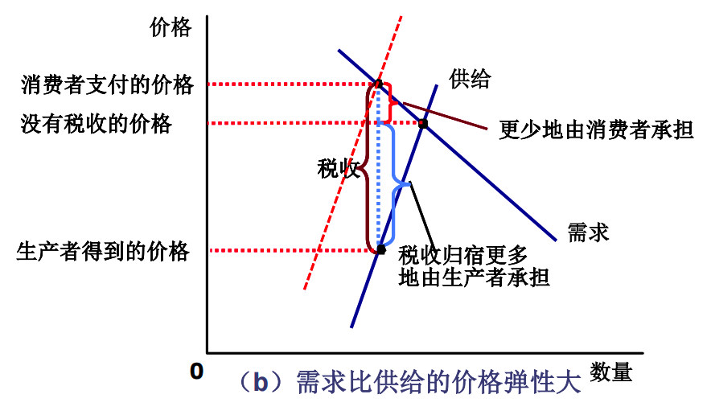

## 3 . 要素投入与市场结构

### 1 . 生产函数

1. <u>边际报酬递减律</u>：在技术水平不变的条件下，若连续等量地把某一种可变生产要素增加到生产系统而维持其他生产要素的投入不变，那么当这一要素总投入量超过某个临界值时，增加该要素一个单位的投入，其边际产量（注意：不是总产量）会逐渐减少。
	
2. <u>规模报酬</u>：因为**要素的投入规模变化**而导致的**产量的变动**称为规模报酬。
	1. 规模报酬不变：投入比例 = 产出比例
	2. 规模报酬递增：投入少，产出多
	3. 规模报酬递减：投入多，产出少
	

3. <u>产品成本</u> = **物化成本** + **工资**
4. <u>产品价值</u> = **产品成本** + **利润和税金**

5. 对线性收入和成本函数，边际收入和边际成本不变（要么 MR 恒大于 MC，要么恒小于，要么恒等），利润最优条件 P＝MC 不一定成立，此时宜结合产能限制和实际需求量/销售量来确定最优产量。

6. 市场结构：**买主和卖主数量的多少、产品之间相互差异的程度以及新的生产者进入市场的难易程度**。

8. 完全竞争：价格由市场定，企业无法左右市场。
9. 垄断竞争：有较多的同类产品提供者，但是他们的产品具有差异并可以相互替代。
10. 寡头垄断：比垄断竞争的产品供应者更少，特点是，一个寡头的决策会影响其它寡头，但同时也被其它寡头的决策所影响，形成了博弈结构。
11. 完全垄断：只有一个巨头，可通过调整价格（产销量也会同时调整）以实现自己的利润最大化。

12. 完全竞争市场：**产品价格 P** = **边际收益 MR** = **边际成本 MC**
	1. <u>短期供给曲线</u>，**MC 大于 AVC**
		**边际成本 MC 位于平均变动成本 AVC 线以上**的增函数部分
		
	2. <u>长期供给曲线</u>，**LMC 大于 LAC**
		**长期边际成本线 LMC 位于长期平均成本 LAC** 之上的部分
		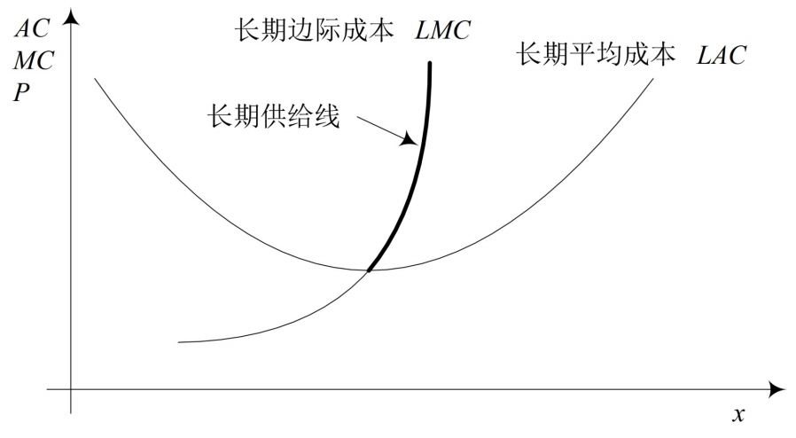
13. 完全垄断市场
	1. 垄断价格高于**边际收益和边际成本**
	2. 垄断价格高于**完全竞争均衡价格**
	

14. <u>市场失灵的原因</u>：**不完全竞争**、**产品外部性**、**非对称信息/不完全信息**、**公共产品问题**。
	**不完全竞争**：垄断
	**非对称信息/不完全信息**：次品问题和劣选择（劣币驱逐良币）、道德风险（骗保）、委托-代理问题（经理摸鱼，不好好给老板打工）
	**公共产品问题**：马路、公园等不能单纯依靠市场机制而提供或调节
	1. 需求量很大，但市场机制的提供者可能很少。
	2. 可能导致“公地悲剧/大锅饭悲剧/公共资源悲剧” ：需要建立起来一套制度或者一个中心化的权力机构解决。
15. **外部性**
	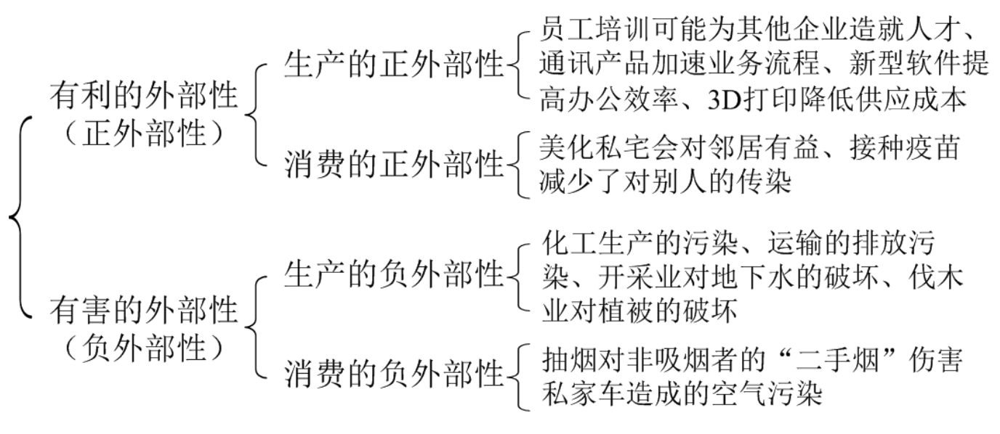

## 4 . 宏观经济分析

1. <u>宏观经济学</u>：宏观经济学是以**整个国民经济活动**为研究对象，主要研究**国民收入**、**社会就业**、**物价水平**、**经济增长速度**、**经济周期波动**等全局性的问题。
2. <u>宏观经济学研究对象</u>：**总产出**、**通货膨胀**、**失业**、**宏观经济政策**

3. GDP 核算方法：**生产法**、**收入法**、**支出法**
4. <u>中国 GDP 曾经的“三驾马车”</u>：**消费**、**投资**、**净出口**。
5. 支出法 GDP = **消费 C** + **投资 I** +**净出口 NX** + **政府购买 G**
6. 【计算】$名义GDP=当期产量 \times 当期价格$ 
7. 【计算】$真实GDP=当期产量 \times 基期价格$ 
8. 【计算】$GDP平减指数=\frac{名义GDP}{真实GDP} \times 100\%$ 
9. 【计算】$实际GDP增长率=\frac{当年的实际GDP-前一年的实际GDP}{前一年的实际GDP} \times 100 \%$

1. <u>失业的种类</u>，根据例子进行判断
	1. **自愿失业**：劳动者因为**自身原因不愿接受工作**而形成的失业。
		不愿意接受现行工资、大学毕业后的“gap year”等
	2. **非自愿失业**：**愿意接受工作但仍找不到工作**的失业。
	3. **周期性失业**：因**需求下降而造成**的失业，它是因**整个经济的支出和产出下降**而造成的。
		- 经济萧条，居民没钱买车，车企销量暴跌，大规模裁剪生产线工人；
		- 经济下行，大家减少旅游、聚餐，酒店、餐饮批量裁员；
		- 金融危机后，房地产成交量大跌，建筑工人、房产中介集体失业。
	4. **摩擦性失业**：是指在生产过程中由于**难以避免的摩擦**（劳资纠纷等）造成的**短期、局部性**失业，常起源于劳动力的供给方；
		- 应届生刚毕业，投递简历、面试空档期暂时没工作；
		- 上班族嫌薪资低主动辞职，在家休整 1–2 个月找新工作；
		- 搬家到另一座城市，离职后重新寻找本地岗位；
	5. **结构性失业**：是指**经济结构变化**等原因造成的失业，结构性失业具有**长期性**，常起源于劳动的需求方。
		- 技术进步诞生了新产业，淘汰了旧产业；但旧产业的员工跟不上技术发展，新产业中的企业又不能雇佣这些老员工而造成结构性失业。
		记忆方法：周期性失业是趋势原因，摩擦性失业是指干活的人（雇员）不高兴，结构性失业和雇主有关。
	6. **自然失业**： **= 摩擦性失业+结构性失业**。
	7. 只有**自然失业**的状态称为**充分就业**。

2. 通货膨胀：一个经济体中的**大多数产品和劳务的价格**在一段时间内**持续普遍上涨**的一种现象。
3. 【计算】消费物价指数（CPI）：$CPI=\frac{一篮子固定商品按当期价格计算的价值}{一篮子固定商品按基期价格计算的价值} \times 100\%$ 不包括房价
4. 【计算】<u>通货膨胀率</u>：$第t年通货膨胀率=\frac{第t年CPI-第t-1年CPI}{第t-1年CPI} \times 100\%$
5. <u>批发价格指数 WPI</u>（工业生产者价格指数）：**大宗物资批发价格加权平均**得到的价格指数，包括原料、中间产品、最终产品和进出口品，**但不包括劳务**。

6. <u>通货膨胀种类</u>
	1. **温和的通货膨胀**：年通胀率**在 10%以内**
	2. **奔腾的通货膨胀**：年通货膨胀率**在 10%到 100%之间**
	3. **超级通货膨胀**：年通货膨胀率**超过 100%时**
	4. **恶性通货膨胀**：**月通货膨胀率超过 50%**（对应的年通胀率可达 12975%）

7. <u>经济周期</u>：又叫商业周期、商业循环，指国民**总产出**、**总收入**和**总就业**相对于它们的潜在水平的波动。
8. <u>经济周期的原因</u>：**内因论**（**货币主义经济周期理论**、**投资过度理论**和**心理预期理论**）、**外因论**、**综合论**。
9. <u>宏观经济政策是政府为了达到</u>**就业水平**和**物价水平**的均衡状态，实现整体经济**健康平稳发展**而对经济活动进行**有意识的干预**
10. <u>宏观经济政策目标</u>：**充分就业**、**价格水平稳定**、**经济持续均衡增长**、**国际收支平衡**。

11. <u>财政政策</u>：国家通过调节**政府支出和收入**水平（如税收和借债水平）以影响总需求状况，进而达到保持经济的持续增长和高就业率目的而采取的宏观经济政策。
	1. <u>政府支出</u>：**政府购买**、**政府转移支付**和**政府债券利息支付**。
	2. <u>政府收入</u>：**税收**（无偿性、强制性、固定性， 占财政收入的 80%）和**政府公债**
	3. **逆风行事**：
		1. 不景气-刺激需求的扩张性财政政策（政府购买⬆️转移支付⬆️税收水平⬇️）
		2. 经济过热-抑制需求的紧缩性财政政策

12. <u>货币政策</u>：**中央银行**通过控制**货币市场中货币供应量**、以及**调节利率**进而影响投资和整个经济支出以达到一定经济目标而采取的宏观经济政策。
	1. <u>货币政策工具主要包括</u>**法定准备金**、**公开市场业务**和**再贴现率**。
	2. **法定准备金**：中央银行规定的商业银行及其他金融机构根据其存款量**必须缴存于中央银行的最低准备金量**
	3. **公开市场业务**：中央银行在金融市场上公开**买卖政府债券**（不是新发行）以控制货币供给量。
	4. **再贴现率**：中央银行对商业银行及其他金融机构**发放贷款的利率**
	5. **逆风行事**
		1. **经济衰退** - **扩张性的货币政策** - **增加货币供给** - 以防止出现通货紧缩 - 法定准备金⬇️、公开市场业务⬇️、再贴现率⬇️
		2. **经济过热** - **紧缩性货币政策** - **减少货币供给** - 以防止出现通货膨胀 - 法定准备金⬆️、公开市场业务⬆️、再贴现率⬆️

## 5. 管理学概述

1. 管理的基本职能：**计划**、**组织**、**领导**、**控制**。
	1. **计划职能**：<u>管理者对</u>**组织的目标和应采取的行动方案**做出**选择和具体安排**的活动过程。
	2. **组织职能**：<u>管理者根据</u>**计划制定的目标**，对组织中的**各种要素**包括人力资源之间的相互关系进行**合理配置**过程。
	3. **领导职能**：<u>管理者为了实现组织目标而</u>**对被管理者施加影响**的过程。
	4. **控制职能**：<u>管理者运用事先确定的标准</u>，衡量实际工作绩效，寻找**偏差及其产生的原因**，并**采取措施予以纠正**的过程。
2. 管理者技能：**概念技能**、**人际技能**、**技术技能**。

3. 泰勒-**科学管理**之父
4. 马斯洛层次需求理论：**生理需要**、**安全需要**、**情感与归属感需要**、**尊重需要**、**自我实现需要**
	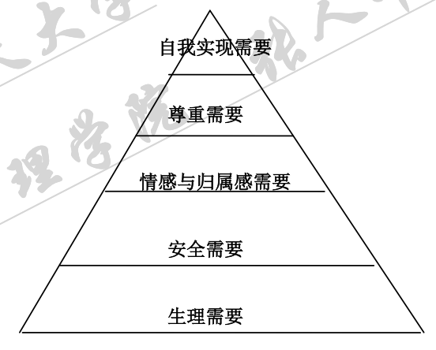
5. **吉尔布雷斯**：<u>*动作研究*之父</u>。侧重工人作业*动作分析*，通过分解、简化、优化操作动作消除无效动作，配套疲劳研究，奠定*工业工程动作分析基础*。
6. **亨利 · 法约尔**：*管理过程*之父，提出*管理五大职能：计划、组织、指挥、协调、控制*（把领导拆成了指挥和协调），同时总结 *14 条管理原则*，构建古典管理学派框架。
7. **霍桑实验**：测定*各种因素*对生产效率的影响。哈佛大学在霍桑工厂开展系列实验，初衷研究照明、薪酬、休息时间等物理、经济条件对生产效率的影响，最终意外发现*人的社会、心理因素作用远大于物质条件*。
8. **梅奥**：人际关系学说。*霍桑实验*主导者，基于实验提出*人际关系学说*：工人是 “*社会人*” 而非经济人；企业存在非正式组织；士气决定生产效率，*开创行为科学管理学派*。
9. **麦格雷戈**提出 *X-Y 理论*，即 X、Y 两种对立人性假设：
	- X 理论：经济人假设，认为人天生懒惰、被动，必须强制管控；
	- Y 理论：持积极人性观，认为人愿意主动工作、自我约束、承担责任，是麦格雷戈主张推崇的管理观点。

## 6 . 管理的职能

1. 管理四大职能：**计划**  **组织**  **领导**  **控制**

2. 计划工作中很重要的一个程序就是**确定目标**。
3. <u>目标管理应遵循</u>**SMART 原则**：**明确性（Specific）**、**衡量性（Measurable）**、**可实现性（Attainable）**、**相关性（Relevant）**、**时限性（Time-based）**

4. <u>组织设计需要考虑的因素</u>：**管理层次与跨度**、**工作专业化**、**部门化**、**命令链**、**集权与分权**、**正规化**
5. 管理跨度与组织层次成反比。跨度越宽层次越少，跨度越窄层次越多。
	
6. <u>组织结构类型</u>：**简单直线制**、**职能制**、**直线职能制**、**委员会制**、**矩阵制**、**事业部制**、**多维立体制**、**柔性组织和组织创新**

7. 如何激励员工是领导职能的一个核心。
8. 激励理论：马斯洛层次需求理论、双因素理论……
	1. 马斯洛需求层次理论：**生理需求**、**安全需求**、**情感与归属感需求**、**尊重需求**、**自我实现需求**
		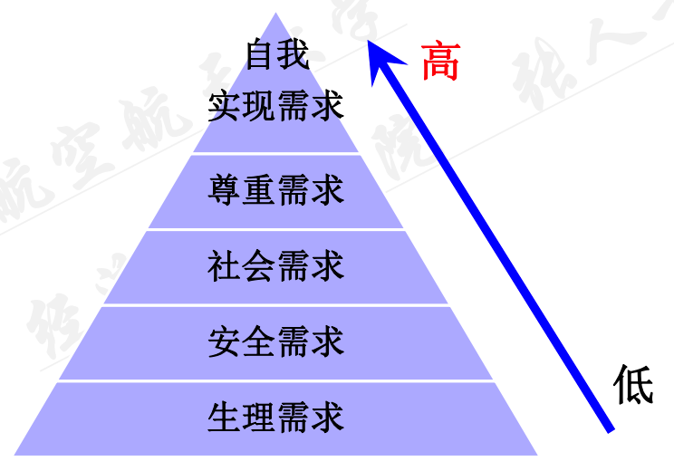
	2. **赫茨伯格**<u>双因素理论</u>：**保健因素（基本）** 和**激励因素（进一步）**。
	3. **麦克利兰**<u>需求理论</u>：**成就需求**、**权力需求**、**归属需求**。
		记忆方法：**成就会激励人，显著的成就可能会让人拥有权力，由此产生权力的归属问题**
	4. **亚当斯**<u>公平理论</u>：**个人所得报酬 / 个人的投入 = 另一个人的报酬 / 另一个人的投入**。
	5. **弗鲁姆**<u>期望理论</u>：**激励 = 效价 × 期望。**

## 7 . 企业与管理

1. <u>*企业*</u>是指从事商品生产、流通及服务性活动，满足社会需要并获取利润，实行**自主经营**、**自负盈亏**、**自我发展**、**自我约束**，独立享受权利和承担义务的法人型或非法人型的基本经营单位，具有**法人资格**。
2. 企业发展的三个阶段：**工场手工业**、**工厂生产**、**企业生产**
3. 企业的产生晚于管理
4. <u>企业的类型</u>，按照企业的法律形式分类：**独资企业**（**非法人型独资企业**、**法人型独资企业**）、**合伙企业**（**普通合伙企业**、**有限合伙企业**）、**公司制企业**（**股份有限公司**、**有限责任公司**）、**合作制企业**。
5. <u>最基本的公司组成包含三个利益方</u>：**股东**（公司所有者）、**董事会**、**高层管理者**。股东掌控公司发展方向和选举董事会成员，然后董事会选举/招聘高层管理人员。高层管理人员负责公司运营，为股东赚取利润。

6. 企业制度：**企业产权制度**、**企业组织制度**、**企业管理制度**。
7. 现代企业制度
	1. **产权制度**：公司法人产权制度，规定*出资者的所有权*和*法人财产权*相互分离，是现代企业制度的核心。
	2. **法人制度**：保证企业*所有权和经营权分离*，包括：股东大会（重要人事和重大事项决定权）、董事会（企业的法定代表和决策者，由股东大会选举）、监事会（与董事会并列，对股东大会负责）、管理层（以总经理为首的执行机构，对董事会负责）。
	3. **有限责任制度**：降低出资人财产风险，利于筹资。
	4. **管理制度**：基于科学的管理原理和方法，对现代企业的整体管理活动进行的计划、组织、领导和控制
8. 现代企业制度的特点：**产权清晰**、**权责明确**、**政企分开**、**管理科学**。

9. <u>企业战略</u>是指企业在激烈的市场竞争环境中，在总结历史经验，调查现状、预测未来的基础上，为谋求生存和发展而做出的**长远性**、**全局性**的谋划或方案。
10. <u>营销组合理论</u>：
	1. 4P 理论：**产品（product）**、**价格（price）**、**地点（place）**、**促销（promotion）**；
	2. <u>4C 理论</u>：**顾客的需要和欲望（consumer needs and wants）**、**顾客的成本（cost to consumer）**、**便利（convenience）**、**沟通（communication）**；
	3. <u>4R 理论</u>：**关系（relationship）**、**节省（retrenchment）**、**关联（relativity）**、**回报（retribution）**；
	4. 4P 理论以**市场 / 产品**为导向，是一种静态组合；4C 理论以**顾客**为导向，企业和顾客双向动态沟通，维持良好关系；4R 理论强调企业与顾客在市场变化的**动态**环境中应建立**长久互动的关系**，以防止顾客流失，赢得长期而稳定的市场。

## 8 . <u>产品开发管理</u>

1. *产品*：能给顾客带来期望利益的东西。
2. 产品设计的来源：**企业内部来源**、**企业外部来源**、**研究和开发（R&D）**
3. <u>*产品设计的评价和原则*</u>：**满足用户需要**、**良好的可制造性**、**产品开发效率**
4. <u>产品开发的驱动方式</u>：**市场拉动**、**技术推动**、**竞争驱动**

5. 产品开发方法：循序渐进的产品开发方法（串行）、集成产品开发方法（IPD，并行）
6. **集成产品开发**（IPD）<u>工具</u>：**质量功能展开**（QFD）
7. 集成化产品开发方法强调产品开发过程中，产品开发、生产准备、生产、营销及服务各个环节活动的 **共同参与、并行开发**

8. **质量屋**
	1. 质量功能展开的目的：使设计团队充分收集和了解客户需求，并将**客户需求**转化为**设计要求**，促进市场、设计和运作等不同领域的跨职能合作。
	2. 构成：
		1. A 区：**获取用户需求**
		2. B 区：**需求的权重**（相对重要性）
		3. C 区：**竞争性评价**
		4. D 区：**技术特性**
		5. E 区：**关系矩阵**
		6. F 区：**技术方案相关性**
		7. G 区：**产品设计目标**
		
9. QFD 迭代：产品在不同开发阶段，关注的特性不同，而集成产品开发（IPD）强调在产品开发的不同阶段进行并行与交互。
	借助 QFD，可将产品特性在不同设计阶段展开质量功能展开，以“客户需求→产品技术需求→ 关键零件特性→关键工艺规划→质量控制参数”，形成迭代开发与交互过程
	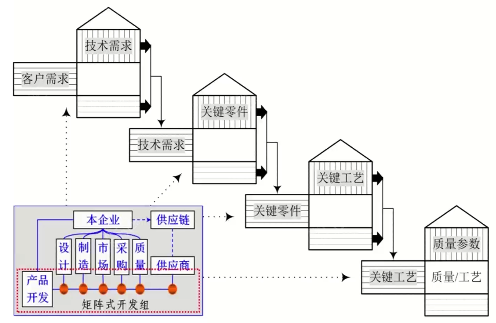

10. <u>顾客满意度模型</u>：**基本需求**、**期望需求**、**兴奋需求**。
	1. **基本需求**：是顾客认为在设计中必须满足的需求或功能。
	2. **期望需求**：是指顾客所希望的超出基本需求的某特殊需求。
	3. **兴奋需求**：此类需求一经满足，即使表现并不完善，也能到来客户满意度的急剧提高，比如出乎顾客预料之外的有用功能。
	
11. 产品设计要**面向顾客**、**面向制造与装配**、**面向环境**。

## 9 . 生产系统流程、结构与战略

1. 职能型组织、流程性组织、复合型组织
2. **流程型/聚焦型组织**
	1. 以内外客户作为过程的输出接受者，使过程的执行结果**及时得到客户检验**。
	2. 跨越职能部门边界，使割裂的业务过程集成，减少了不必要的部门间的**协调过程和扯皮**。
	
3. **复合型组织**中既有职能型结构也有流程型结构构；根据不同领域的特点追求不同的高效率，从而获得**整体效率的优化**。

4. *流程图的三种形式*：**工艺流程图**、**流程程序图**、跨职能流程图。
	
5. 流程再造
	1. **企业流程再造 BPR**：人们习以为常的企业流程多是根据早年的观念发展而成的，许多流程早已没有存在的价值，需要进行**彻底的、根本的重构与改造**
	2. **逐步改进**/**持续改进**：改进过程是一个连续的**戴明循环（Plan-Do-Check-Action, PDCA）**
	3. *业务流程再造*：对业务流程进行**根本性**的重新考虑和重新设计，从而显著的改进关键的绩效指标。（一般不会考虑流程再造而是采取小步骤流程改进）。

6. 生产线布置：**工艺式布置**、**对象式布置**、**固定式布置**、**单元式布置**。
	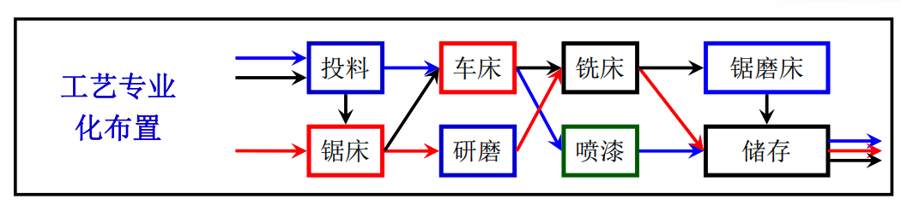
	
	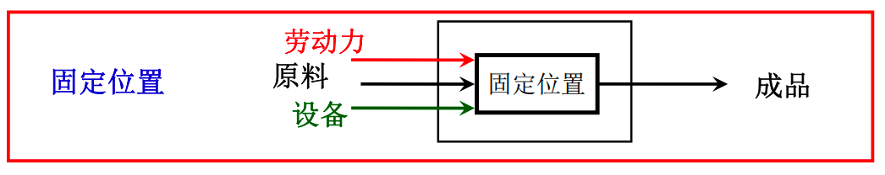
	

8. 生产管理方式：<mark style="background:#fff88f">这个考试会考</mark>
	1. **备货生产 / 推式生产**：根据需求预测，生产并储备产品库存，等待顾客购买
	2. **按单生产 / 拉式生产**：拿到顾客订单之后才根据订单需求开始生产
9. 客户定制分离点：**推 /拉过程的过渡点**
	分离点越靠上游，定制能力越强，反之越弱。

10. 给例子问适合什么生产系统类型（批量流水型等，男装-女装）
	男装容易上市，因为男装更标准化批量化，衬衫西服等，而女装更个性化定制化
11. 生产系统类型：**项目型**、**单件小批型**、**批量流水型**、**大量流水型**（**人工节拍流水线**、**机器节拍流水线**）、**连续流程型**。
	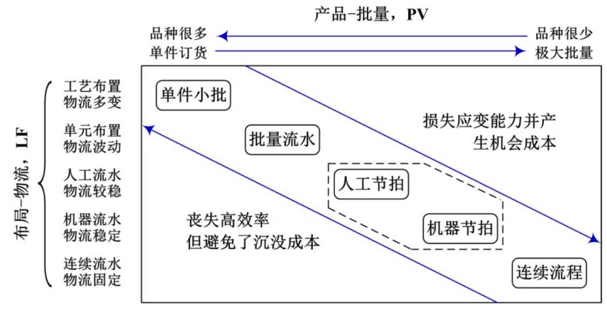
12. 生产系统结构‐功能关系悖论：没有哪种生产类型能同时在**物流连续性（效率）** 和**应变能力（柔性）** 两方面都达到最高水平。
13. CIMS（信息技术，全局集成） 和 JIT（准时化生产） 在一定程度上解决了“结构‐功能”悖论，被称为世界级制造系统
14. 大规模定制：在**大量生产**的同时实现**多品种变化**，且能根据顾客需求进行**产品的模块化配置**，就实现了大规模定制（ mass customization ）生产

## 10 生产与供应链管理

1. *需求变化的影响因素*：**趋势因素**、**季节性因素**、**周期性因素**、**随机因素**。
2. 需求预测方法：**主观预测法**、**客观预测法**（**时间序列预测法**（**移动平均法**、**指数平滑法**） 、 **因果预测模型**）
3. 库存成本：**保存成本**、**订购成本**、**缺货惩罚成本**。
4. 生产计划体系结构：**综合生产计划**、**主生产计划**、**物料需求计划**、**车间调度计划**、**生产计划滚动**。

MRP——推式生产方式
1. MRP 物料需求计划：将**预测的需求**通过**产品物料清单（BOM）** 分解为原材料、零部件的生产或采购计划，并下达给各生产单位启动生产
2. MRPII：IBM 公司在 MRP 的基础上，增加了**财务会计管理职能**，实现了生产、库存、采购、销售、财务和成本子系统的信息集成
3. 产品物料清单（BOM）：以树状分层结构将产品分解为部件、零件直至原材料。

JIT——准时制生产（拉式生产方式）
1. 准时制生产（JIT）：就是要求产品线各环节将**必要的产品**（ 原材料、零部件或成品），以**必要的数量**和**完美的质量**，在**正确的时间**送往**正确的地点**。
2. JIT 的生产是等顾客需求到达才开始，因此是**需求拉动**的生产方式（和**计划推动**的持有库存生产方式相对）
3. JIT 基于**实际需求信息**进行计划分解，而 MRP 是根据**需求预测**进行计划分解
4. 两种看板：**搬运看板**、**生产看板**。
5. 看板系统的核心原则是：“**看板为王**”，**无看板，不搬运**；**无看板，不生产**。

6. *供应链管理*：企业为获得竞争优势，对供应链中的**物料流**、**信息流**、**资金流**、**工作流**、**贸易伙伴关系**等进行的**计划、组织、协调、控制**的一体化管理。
7. 供应链管理策略
	1. **纵向一体化**：**扩大规模**，“**大而全**”的企业经营模式
	2. **横向一体化**：**重点做好自己擅长的业务**，通过与其他企业密切合作，整合供应链上的资源而获得成功。
8. 供应链角色：**供应商**、**制造商**、**分销商**、**零售商**、**顾客**。
9. 供应链决策分层：**战略层**、**战术层**、**运作层**
	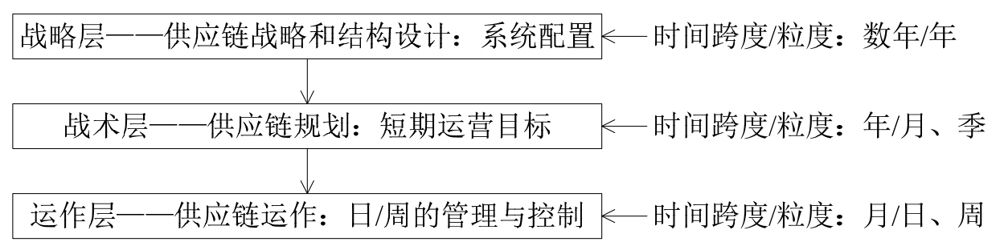
	记忆方法：先确定战略，再细化到规划，然后开始运行。

10. *供应链由一系列流程组成*，这就是**工作流**；工作流是*资金流*、*信息流*、*物流*的逻辑支撑。
11. **业务循环流**：**采购循环**、**制造循环**、**补货循环**、**顾客订单循环**。
	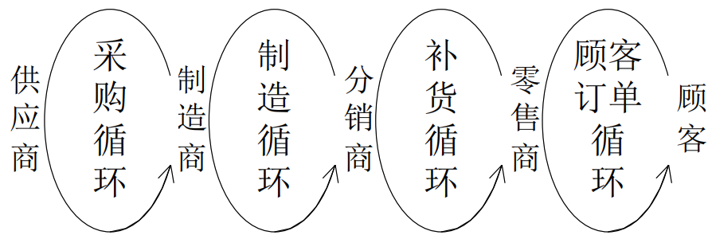
12. **产品增值流**：**原材料**——**零部件**——**成品**——**分销**——**零售**——**顾客**。
	1. 增值链前半部分：“原材料→零部件→成品” 是通过不断注入**有形的物质和付出劳动**而使产品价值不断增长
	2. 增值链后半部分：“分销→零售→顾客” 提高**便利性**&**注入劳动来提高产品满足需求的能力**（分拣包装等），此外也增值了
	3. 所谓增值，指的就是增加了顾客价值。
13. **响应性**和**生产效率**一般是互悖的：高响应——低效率，高效率——低相应。

14. 牛鞭效应：
	1. 定义：客户需求的微小波动，会引起**上游制造商、供应商**等所获**信息**的**剧烈变化**。
	2. 原因：**信息加工**、**配给和短缺博弈**、**大批量效应**、**价格恐惧**、**其他原因**。

## 11 质量管理

1. 现代质量管理发展阶段：**质量检验（泰勒）**——**统计质量管理（休哈特）**——**全面质量管理（费根堡姆）**——**标准化质量管理**
	记忆方法：看结果检验——用统计方法来管理——趋于全面——趋于标准化。
	1. 质量检验阶段：由美国的泰勒提出。
		在生产出产品之后，进行*事后检验*，但在生产过程中*没有进行过程控制*。
		事后检验通常是*全数检验*，花费较高，*不适用于破坏性检验*（如汽车安全气囊质量检验）的情况，也无法进行事前预防。
	2. 统计质量管理阶段
		1924 年，贝尔实验室休哈特的“过程控制研究组”提出了“*事先控制和预防*”，建立了生产过程控制图；
		1929 年，休哈特的同事道奇和罗米格的“产品控制研究组”，提出了*抽样检验*（sampling）方法。
		1920——1940 年代进入了统计质量管理阶段：运用统计推断原理，实现生产过程的*事先控制*，用*抽样*方法弥补了质量检验阶段各种方法的不足。
	3. 全面质量管理阶段
		19 世纪 60 年代由通用电气（GE）的阿曼德·费根堡姆（1922-2014）提出，是目前最主流的方法。
		全面质量管理将质量控制，从原来的生产系统扩展到*产品寿命周期的全过程*，同时强调*全体员工、全体部门*参与质量控制。
		更适应现代多样化生产对质量管理的要求，使质量管理从局部走向了全面系统的阶段。
	4. 标准化质量管理阶段
		由于生产规模及生产模式的多样性，所生产的同一系列的产品也出现了质量标准的不同，促使许多企业研究*质量管理行业内的统一问题*，因此制定了各种*质量管理标准*。
		通过 *ISO* 认证是现代企业的普遍做法。
2. 质量管理大师
	1. 戴明：“**十四要点**”、**戴明环**。
		戴明环：PDCA 是一个质量持续改进模型，包括持续改进与不断学习的四个循环反复的步骤：**计划(Plan)**、**执行(Do)**、 **检查(Check)**、**处理(Action)**。
	2. 朱兰：**朱兰三部曲**、**质量螺旋曲线**。
		**朱兰三部曲**：**质量计划**、**质量控制**、**质量改进**。
		记忆方法：运作之前要计划，运作之中要控制，运作之后要改进。
	3. 克劳斯比：“零缺陷之父“、零缺陷质量管理。
	4. **费根堡姆**：**全面质量管理**（TQM）。
		全面质量管理：企业中所有部门、所有组织、所有人员都以产品质量为核心，控制全部业务过程中影响质量的因素。
	5. 石川馨：**鱼骨图 / 因果图 / 鱼刺图**。

### 2 质量管理工具

1. 质量管理工具：调查表、分层法、排列图、因果图、直方图、散布图、控制图。
2. 调查表：
	1. 缺陷位置调查表
		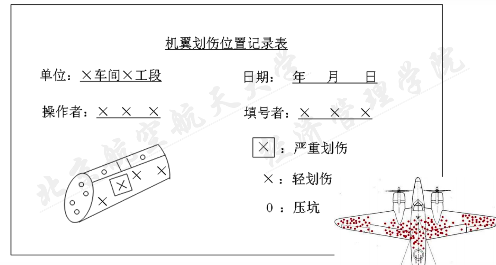
	2. 不良品检查表
		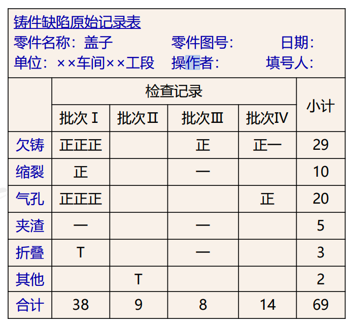
	3. 质量分布调查表
		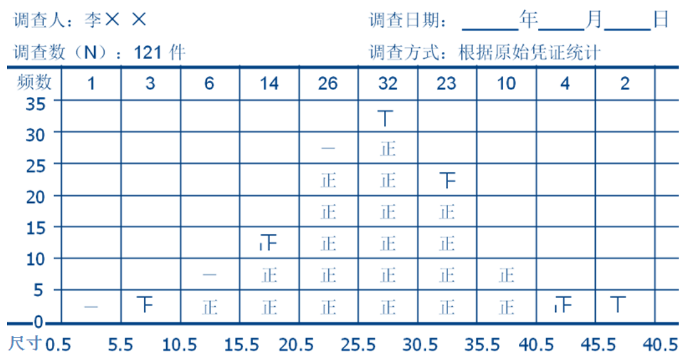
3. 分层法
	
	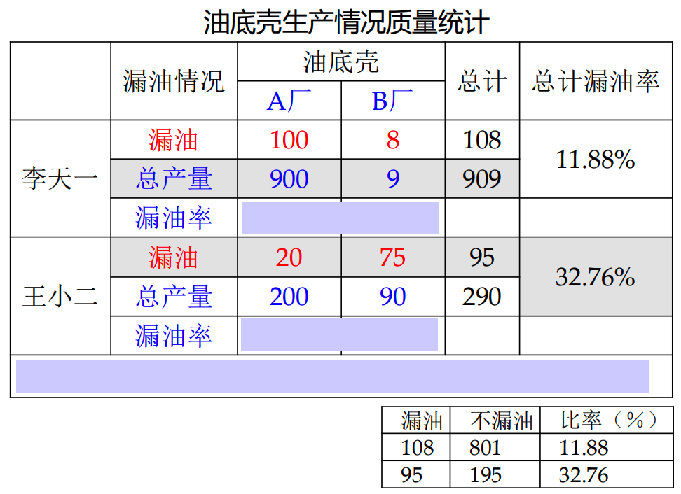
4. 排列图又称帕累托图。
	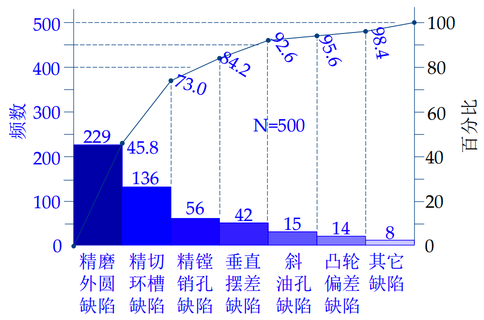
5. 因果图
	
	 
6. 直方图 **判断类型**
	
	**标准：正常直方图** **陡壁：尺寸偏离** **双峰：数据多个来源**
	**孤岛：出现异常** **平顶：可能刀具变钝** **锯齿：数据分组不当**
	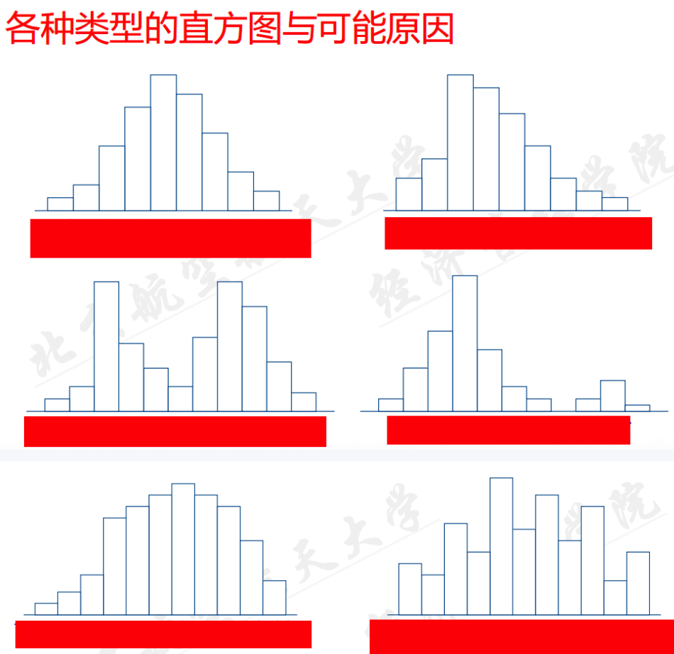
7. 散布图/相关图 **判断**
	**强正相关** **强负相关**
	**弱正相关** **弱负相关**
	**不相关** **非线性相关**
	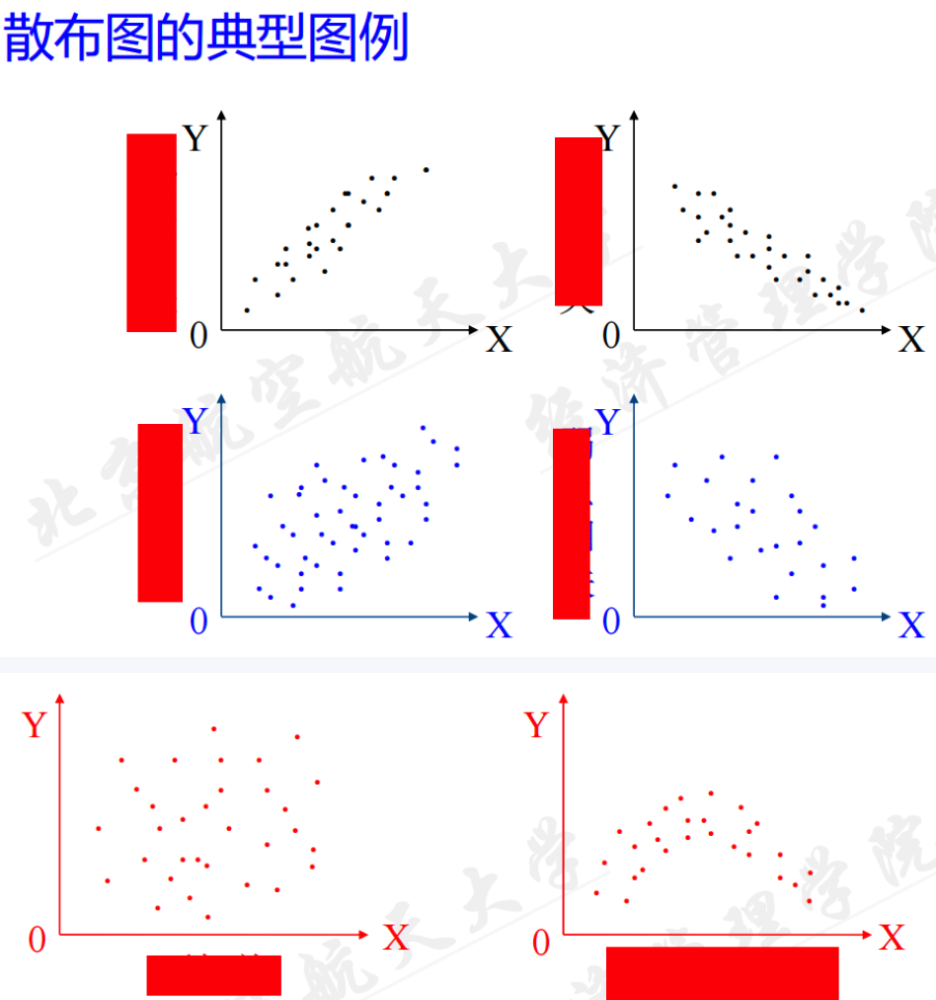
8. 控制图
	
	1. ±3σ原理：任意抽取一个样品 X，如果处于**正常控制**的生产状态中，则可以认为**X 的特性值（如均值）大概率分布在 μ±3σ 之内（μ为期望值， σ为方差）**，而出现在该范围之外是不可能的或小概率事件。
	2. 上下控制线不一定刚好 3σ线。
	3. 判稳准则：控制图上的点没有越出控制界限，且点的排列无缺陷
		即同时满足
		1. 连续 25 个点都在控制限内；
		2. 连续 35 个点，至多 1 个点落在控制限外；
		3. 连续 100 个点，至多 2 个点落在控制限外。
	4. **判异准则**：PPT 上的八个异常情况发生其一，则证明存在异常
		
	5. 两类错误：和概统中的假设检验两类错误有点像，第一类错误为**α错误**，本来是真的结果误认为假的虚发警报，**弃真**；第二类错误为**β错误**，本来是假的结果误认为真的，漏发警报，**纳伪**。

### 3 质量成本

1. 质量成本：**质量运行成本**（**鉴定成本**、**预防成本**）、**质量故障成本**（**内部损失成本**、**外部损失成本**）
	
	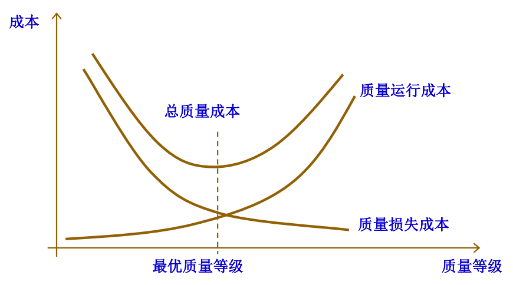
2. 六西格玛管理
	1. 来自摩托罗拉公司
	2. 假设设计公差范围为 ±T，如果随机数的 ±3σ在±T 内，不考虑公差中心偏移，那么产品合格率会达到 99.73%。
	   若±6σ 在±T 内，则当公差中心无偏移时，产品合格率接近于 1（对应缺陷率为 5 亿分之 1）
	3. 管理的流程包括：（**DMAIC**）**定义(Define)**、**测量(Measure)**、**分析 (Analyze)**、 **改进(Improve)**、**控制(Control)**。

## 12 项目管理

1. 项目：项目是为获得独特产品、服务或成果而实施的临时性工作。**临时性**，**独特性**。
2. 项目管理技术：**工作分解结构 WBS**、**责任分配矩阵 RAM**、**关键路径法 CPM**、**计划评审技术 PERT**、**挣值分析 EVA**。

### 2 *工作分解结构 WBS 和责任分配矩阵 RAM*

1. 工作分解结构：WBS（ work breakdown structure ）用于界定项目工作范围，它是以**可交付物**为导向的**工作层级分解**，所分解的对象是项目团队为实现项目目标、提交所需可交付成果而实施的工作，其最低层次称为工作包。
	记忆方法：以可交付物（就是可以给人看的东西）为导向，分解工作。
	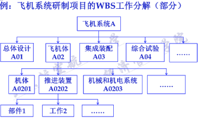

2. 责任分配矩阵（RAM）：将工作分解结构与干系人联系起来。

### 3 项目网络与关键路径 CPM

1. 单代号网络图 AON（activity on node）：活动在点上
	
2. 双代号网络图 AOA（activity on arrow）：互动在边上
	

### 4 挣值分析 EVA

1. 挣值分析需要获取三种不同的费用值：**计划价值 PV**、**挣值 EV**、**实际成本 AC**。

2. **完工预算 BAC (budget cost at completion)**：预计完工要花多少钱。在计划阶段对项目进行成本估计，反映了项目/工作的计划价值。
3. **计划价值/计划值 PV (planned value)**:当前理论应该花了多少钱。指在某检查点，按计划应完成的工作所对应的预算成本。
4. **实际成本 AC (actual cost)**：当前实际花了多少钱。指已完成的工作消耗的实际费用。
5. **挣得值 EV (earned value)**：当前实际工作量理论应该花了多少钱。指经过验收且符合质量要求的工作，基于实际完成的比例，按照预算标准折算之后的价值。

6. **成本偏差**（Cost Variance，CV）：衡量项目**成本绩效**。**CV = EV−AC**。
7. **成本绩效指数**（Cost Performance Index，CPI）：衡量项目**成本效率**。**CPI = EV／AC**。
	代表了成本节省程度，越大代表节省的越多；若 CV<0 或 CPI<1，代表成本超支。

8. **进度偏差**（Schedule Variance，SV）：衡量项目**进度绩效**。**SV = EV – PV**。
9. **进度绩效指数**（Schedule Performance Index，SPI）：衡量项目**进度效率**。**SPI = EV／PV**。
	代表了进度超前程度，越大代表超前的越多；若 SV<0 或 SPI<1，代表进度延迟。

## 13 投资项目经济评价

### 1 投资与收益

1. 投资形成的资产：**固定资产**、**无形资产**、**递延资产**、**流动资产**。

2. 收益
	1. 利润 = **销售收入 – 总成本**
	2. 销售收入 = **销售量×单价**
	3. 总成本 = **生产成本 + 期间费用**
3. 生产成本：**直接成本**（变动成本） + **制造费用**
	1. **直接成本**：直接消耗原料燃料，支付工资等。
	2. **制造费用**
		1. 折旧：**固定资产**由于**磨损或陈旧因素**价值降低。
			1. 折旧的方法：直线折旧法（常用）、加速折旧法、工作量折旧法。
			2. **账面价值**：固定资产原值减去已经计提的折旧费，称为固定资产账面价值。
			3. **残值**：在项目运行寿命期末的剩余账面价值
		2. 其他制造费用：车间管理人员的工资、设备的日常维护费等
4. 期间费用：非直接生产部门的费用
	1. **管理费用**：公司高层办公费、工资、**递延资产**和**无形资产**摊销等；
	2. **财务费用**：贷款利息、汇兑损失等；
	3. **销售费用**：市场销售发生的费用，如广告、促销活动等。
	记忆方法：销售部门的财务管理

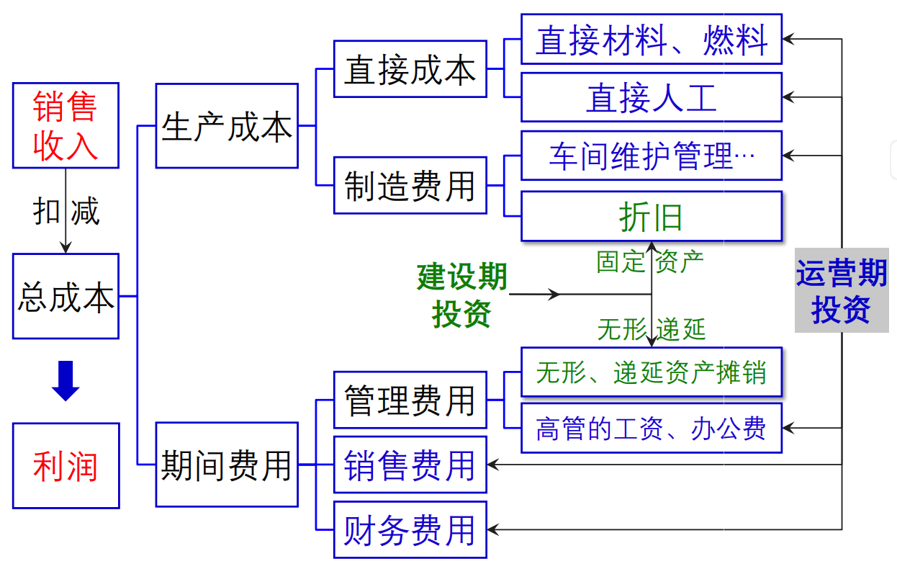

#### 1.4 现金流

1. 现金流量是指项目/工程技术方案在寿命期内各支付周期（年）收入和支出的**货币量**。
2. 净现金流量：某支付周期的收入和支出的**代数和**。
3. 经营成本 **= 总成本 – 折旧 – 资产类摊销**
4. 净现金流 = **利润 + 折旧 + 资产类摊销**。
5. 净现金流 = **销售收入 – 经营成本**
6. 现金流量图（重要！！！）
	1. 支出项目：**年初**，**下箭头**
	2. 收益项目：**年末**，**上箭头**
	注：这里的年初年末是对于一年来说的，通常支出在一年的年初发生，而收益在一年的年末发生。

### 2 资金的时间价值

1. 资金的时间价值：资金在周转使用过程中随着时间因素而形成的**价值差额**（资金随时间增长而值钱，一般都是值钱了）

### 3 经济可行性分析

#### 3.1 投资回收期

1. 静态投资回收期：不考虑**资金时间价值**，在项目投产后，以每年取得的净收益，将全部投资回收所需的时间。即**累积净现金流为 0** 的 n 值
2. 当项目的投资回收期 n 小于/短于基准投资回收期 n0，即：**n ≤ n0 时，就认为项目是可行的**。

3. 动态投资回收期：将各时间点上的净现金流统一折现之后再计算投资回收期。即满足下式的 nd，其中 i0 为行业基准贴现率
	$\sum\limits^{n_{d}}_{t=0} F_{t}(1+i_{0})^{-t} = 0$

#### 3.2 净现值法

1. 净现值（net present value，NPV）：不同时间上发生的净现金流量，通过某个**规定的利率** $i_0$ 统一折算为第 0 年的**现在值，然后求代数和**。
2. 规定的利率 i0 称为**基准贴现率/基准折现率**
3. $NPV(i) = \sum\limits^{n}_{t=0}F_{t}(1+i_{0})^{-t}$
	$F_{t}$ ——第 t 年末净现金流量
	$n$ ——项目寿命期
	$i_0$ ——基准折现率
4. 以净现值法判断项目可行的标准是 $NPV (i_0) ≥ 0$

#### 3.3 内部收益率法

1. 使 NPV 恰好等于 0 的折现率就称为**内部收益率**(IRR)
	即 $NPV(IRR) = \sum\limits^{n}_{t=0}F_{t}(1+IRR)^{-t} = 0$
2. 当 $i_{0}<IRR$，项目有收益；若 $i_{0}$ 刚好等于 $IRR$，收益刚好为 0。

### 4 项目方案的经济比较

#### 4.1 寿命期相同方案的比较

1. 两个方案的现金流量之差的净现值称为**投资增额净现值**
2. 法 1：将两个方案的现金流之差作为**虚拟项目**，判断虚拟项目的可行性。
3. 法 2：直接比较各自 NPV，NPV 大的更好。

#### 4.2 寿命期不同方案的比较

1. **最小公倍数法**：或称重复法，是以两个方案服务寿命的最小公倍数作为共同期限，并假定这两个方案在这个期限内可以**重复实施若干次**。

#### 4.3 非常规投资项目

1. **常规投资项目**
	1. 净现金流从负变正只一次
	2. 全部净现金流量代数和为正
2. **非常规投资项目**：只有投入没有收益、或只有收益没有投入、或现金流多次变号、或者净现金流代数和小于 0 等项目，统称为非常规（投资）项目
	
	

